# 第三章 SQL基础

### 3.2 SQL数据定义

#### 3.2.1 基本类型

- char(n)
- varchar(n)
- int
- smallint
- numeric(p,d):如numeric(5,2)可以存444.32,但是不能存44.332
- real,double precision
- float(n):精度至少为n位的浮点数

#### 3.2.2 基本模式定义

$$
create\ table \ r\\
(A_1,D_1\\
A_2,D_2\\
....\\
A_n,D_n\\
<完整性约束_1>\\
....\\
<完整性约束_k>);
$$

完整性约束：

- $primary\ key(A_1,A_2..A_k)$
- $foriegn\ key(A_1,A_2,..A_k)\ \ references\ s$
- $not\  null$

**对表的操作**

- drop table :删除表
- alter table r add A D:新增属性，以及它的类型
- alter table r drop A:删除属性

### 3.3 SQL查询基本结构

基本结构：
$$
select\ &A_1,A_2,...A_n\\
from\ &r_1,r_2,...r_n\\
where\ &P;
$$

- 可以select distinct/all 表示是否有重复元素。默认为all

- 支持的运算符：and、or、 not、<、<=、>、>=、+、-、*、/、=、<>(不等)

### 3.4 附加运算 

1. 更名运算 as:即可以用在select中，也可以用在from子句中，一个重要的应用就是比较同一个关系中的元组，如
   $$
   \begin{align}
   &\pmb{select}\ \ distinct\ \ T.name\\
   &\pmb{from}\ \  instructor \ \ as\ \  T,instructor \ \ as\ \  S\\
   &\pmb{where}\ \ T.salary>S.salary\ \ and\ \ S.dept\_name='Biology';
   \end{align}
   $$

2. 字符串运算：通过**like**来表达模式，也可用**not like**来表示不匹配项，并且模式是大小写敏感的

   - **%**：匹配任意字符串

   - **_(下划线)**:匹配任意字符

   - 可以用**\\**来对某些特殊字符进行转义,并使用关键字**escape**,如 like 'ab\%cd%' escape,匹配以‘ab%cd’开头的字符串？
   
3.  排序：
  $$
  \begin{align}
  &\pmb{select}\ \ *\\
  &\pmb{from} \ \ instructr\\
  &\pmb{order}\ \pmb{\ by}\ \ salary\ \ \pmb{desc},name\ \pmb{asc};
  
  \end{align}
  $$
  
4. 元组形式，可以进行元组赋值，判等

### 3.5 集合运算

注意集合运算默认是去重的，如果想不去重，则需要用到关键字**all**,这一点和select是相反的。

- **union**:并运算
- **intersect**:交运算
- **except**：差运算

例子：
$$
\begin{align}
(&\pmb{select}\ \ course\_id\\
&\pmb{from}\ \ section\\
&\pmb{where}\ \ semester='Fall'\ and \ year=2017)\\
&\pmb{except\ all}\\
(&\pmb{select}\ \ course\_id\\
&\pmb{from}\ \ section\\
&\pmb{where}\ \ semester='Spring'\ and \ year=2018);\\
\end{align}
$$

### 3.6 空值

空值为$null$,SQL提供了一种新的类型$unknown$,,但是与$and,or,not$运算结果是否为$unknown$与具体的逻辑运算符有关(类似于编程语言中的$\&\&和||$

SQL还提供了$is\ null $和$is\ not \ null$。以及$is\ unknown和is\ not\ unknown$来测试一个比较运算的结果是否为$unknown$,含有$null$的重复元组会被去重(使用$distinct$时)

### 3.7 聚集函数

- 平均值：**avg**
- 最小值:**min**
- 最大值:**max**
- 总和:**sum**
- 计数:**count**，若要去重，可以**select count(distinct A)**

#### 3.7.2 分组聚集

group by可以对元组进行分组然后使用聚集函数，并且可以按照多个属性来进行分组，

**查找每个系的平均工资**
$$
\begin{align}
&\pmb{select}\ dept\_name,\pmb{avg}(salary)\ \pmb{as}\ avg\_salary\\
&\pmb{from}\ instructor\\
&\pmb{group\ by}\ dept\_name
\end{align}
$$
注意，出现在select中的但没有出现在group by中的那些属性，只能作为聚集函数的参数，否这样的查询就是错误的。

#### 3.7.3 having子句

有时候，对分组进行条件限定比对元组限定条件更有用。于是诞生了SQL的having子句

与select类似，任何出现在having中，没出现在group by中的属性，必须出现在聚集函数中。

**eg**:**对于**在2017年**讲授的每个课程**，如果该课程至少有两名学生选课，**找出**选修该课的**所有学生的总学分的平均值**

$$
\begin{align}
&\pmb{select}\ course\_id,semester,year,sec\_id,\pmb{avg}(tot\_cred)\\
&\pmb{from}\ student,takes\\
&\pmb{where}\ student.ID=takes.ID\pmb{\ and}\ year=2017 \\
&\pmb{group\ by}\ course\_id,semester,year,sec\_id\\\
&\pmb{having\  count}\ (student.ID)>=2;
\end{align}
$$

### 3.8 嵌套子查询(重难点)

#### 3.8.1 集合成员资格

可以用in/not in +子查询结果

#### 3.8.2 集合比较

**至少某一个：**

$<some,<=some,>=some,=some,<>some$,其中$=some$等价于$in$,但是$<>some$并不等价于$not\ in$,

**所有：**

$<all,<=all,>all,>=all,<>all$,$<>all等价于not\ in$，但是$=all$并不等价于$in$（比in更强）

#### 3.8.3 空关系测试

检测一个子查询结果是否包含元组，可用$exists/not\ exists$

一个重要用法：
$$
B\subseteq A等价于not \ exists(B\ except\ A) 
$$
例子：找出选修了Biology系的所有课程的学生
$$
\begin{align}
&\pmb{select}\ S.ID,S.name\\
&\pmb{from}\ student \ \pmb{as}\ S\\
&\pmb{where\ not\ exists}((\pmb{select}\ course\_id\ \pmb{from}\ course\ \pmb{where}\ dept\_name='Biology')\\
&\pmb{except}\\
&(\pmb{select}\ T.course\_id\ \pmb{from}\ takes\pmb{\ as}\ T\  \pmb{where}\ S.ID=T.ID)) 
\end{align}
$$

#### 3.8.4 重复元组存在性测试

可以用**unique(子查询结果)**，若查询结果唯一，则为真，当然也可以用**1>=(子查询结果的数量)**来等价替代。此外还有**not unique**

####3.8.5 from中的子查询

from中也可以有子查询，并且from中的子查询必须被重命名，

from子查询不能使用来自同一from子查询的相关变量，如果要用的话，可以用**lateral(子查询结果)**

#### 3.8.6 with子句

创建一个临时关系供后续查询使用(先用with创建临时关系吗，后面才是select from where)

例子：找出**工资总额**大于**所有系平均工资总额**的所有系。
$$
\begin{align}
&\pmb{with}\\
&\ dept\_total(dept\_name,value)\ \pmb{as}\\
&(\pmb{select} \ dept\_name,\pmb{sum}(salary)\\
&\pmb{from}\ instructor\\
&\pmb{group\ by}\ dept\_name),\\
&dept\_total\_avg\pmb{\ as}\\
&(\pmb{select\ avg}(salary))\\
&\pmb{from}\ dept\_total)\\
&\pmb{select}\ dept\_name\\
&\pmb{from}\ dept\_total,dept\_total\_avg\\
&\pmb{where}\ dept\_total.value>dept\_total\_avg.value
\end{align}
$$
这里建立了两个临时关系dept_total,和dept_total_avg,并且建立dept_total_avg时用到了dept_total,这在with子句中是可以的，而在from 中的嵌套子查询中除非用lateral,否则是不允许的。

#### 3.8.7 标量子查询

子查询结只包含单个元组的查询称为标量子查询，这样的子查询可以出现在任何单个变量出现的位置。

### 3.9 数据库的修改

1. **删除**：
   $$
   \begin{align}
   &\pmb{delete\ from}\ r\\
   &\pmb{where}\ P
   \end{align}
   $$
   若果P为空，则会删除所有元组，但是会保留关系。并且，delete语句是先对所有元组进行检查，若满足条件，则进行标记，再统一删除，这样做设为了避免一些错误。下面的也是类似。

2. **插入**

$$
\begin{align}
&\pmb{insert\ into}\ r(A_1,A_2,...A_n)\\
&\pmb{values}(xxx,xxx,...xxx)
\end{align}
$$

其中属性可以不写，但必须与数据表定义的顺序来赋值。也可以将查询的结果直接插入,

即
$$
\begin{align}
&\pmb{insert\ into}\ r(A_1,A_2,...A_n)\\
&\pmb{select\ A_1,....A_n}\ from \ r_1
\end{align}
$$

3. **更新**:基本语法
   $$
   \begin{align}
   &\pmb{update}\ r\\
   &\pmb{set}\ A=xxx\ \\
   &\pmb{where}\ P
   \end{align}
   $$
   

​	为了避免更新顺序不同导致的问题，SQL引入了case
$$
\begin{align}
&\pmb{update}\ r\\
&\pmb{set}\ A= \pmb{case}\\
&\ \ \ \ \pmb{when}\ pred_1 \ \pmb{then} \ result_1\\
&\ \ \ \ \pmb{when}\ pred_2 \ \pmb{then} \ result_2\\
&\  \ \ \ ...\\
&\ \ \ \ \pmb{when}\ pred_n \ \pmb{then} \ result_n\\
&\ \ \ \ \pmb{else}\ result_0\\
&\pmb{end}
\end{align}
$$

## 第四章 中级SQL

### 4.1 连接表达式

#### 4.1.1 自然连接

**自然连接：**自然连接只考虑两个关系模式中都出现的属性上取值相同的元组。
$$
student \pmb{\ natural \ join}\ takes
$$

查询已经选课的学生可简写为
$$
\begin{align}
&\pmb{select} \ name \,course_id\\
&\pmb{from}\ student\ \pmb{natural\ join} \ takes;
\end{align}
$$

一般情况下的写法：
$$
\begin{align}
&\pmb{select}\ A_1,A_2,...A_n\\
&\pmb{from}\ r_1\ \pmb{natural\ join\ r_2\ natural\ join ...natural\ join}\ r_m\\
&\pmb{where}\ P;
\end{align}
$$
为了避免
$$
\begin{align}
&from\ student\ natural \ join\ takes,course\\
和\\
&from \ student\ natural\ join\ takes\ natural\ course
\end{align}
$$
的区别，SQL提供了一种自然连接的构造形式，它允许你来指定究竟哪些属性相等。

即$r_1\ join \ r_2\ using(A_1,A_2)$,用于指定属性相同进行连接。
$$
\begin{align}
&\pmb{select}\ name,title\\
&\pmb{from}\ student\ \pmb{nartual\ join}\ takes\ \pmb{join}\ course\ \pmb{using}\ (course\_id);
\end{align}
$$

#### 4.1.2 连接条件

另一种连接条件形式：
$$
r_1\ join\ r_2\ on\ P 
$$
on条件可以表达任何SQL谓词，因此比自然连接更为丰富。

#### 4.1.3 外连接

对于上述连接，称为内连接(不写默认内连接)，内连接并不会不匹配的任意一方元组，因此引入了外连接

- **左外连接(left outer join**)：只保留出现在左外连接运算之前的关系中的元组(另一边补上空值)
- **右外连接(right out join)**：只保留出现在右外连接运算之后的关系中的元组
- **全外连接(full outer join)**：保留出现在两个关系中的元组(等价于左右外连接的并)

外连接也可以用**on**条件而不用**natural**，注意，外连接只会给对应内连接没有贡献的元组增加补空值的元组，on条件是外连接的一部分，而where不是。

#### 4.1.4 连接类型和条件

通常使用**inner**和**outer**来区分内外连接，并且**inner**是可以不写的，即默认为内连接。

### 4.2 视图

SQL允许定义一种虚拟的关系，他在概念上包括查询结果，该虚拟关系并不预先计算和存储查询结果（防止查询结果改变），而是只存储查询表达式，在使用虚拟关系时才执行查询计算出来，这种虚拟关系我们称之为**视图(view)**

#### 4.2.1 视图定义

$$
\begin{align}
\pmb{create\ view}\ v(A_1,A_2...)\ \pmb{\ as}<查询表达式>\\

\end{align}
$$

视图和with子查询不一样，视图可以永久保存，在被删除之前一直可用。

一旦定义了视图，就可以像查询关系那样对视图进行查询。

#### 4.2.3 物化视图

有些数据库允许存储视图结果，但它们保证：一旦实际关系发生改变。则视图也跟着更新。这样的视图被称为**物化视图(materialized view)**

保持物化视图一直保持在最新状态的过程称为**物化视图维护**或者**视图维护。**

#### 4.2.4 视图更新

一般不允许对视图进行修改，除非满足一下条件，视图称为**可更新的**

- from子句中只有一个数据库关系
- select中只包含关系的属性名，并不包含任何表达式、聚集或者distinct声明
- 没有出现在select子句的中的任何属性都可以取null值，也就是这些属性没有非空约束，也不构成码的一部分。
- 查询中无group by和having子句。

可以在视图定义末尾加入$with\ check\ option$子句，这样插入数据如果不满足视图的where条件或者where子句的条件，数据库会拒绝向视图中插入数据。

### 4.3 事务

commit work：提交事务，提交后，事务执行更新在数据库之中，新的事务开始。

rollback work:回滚事务

一旦提交事务，就不能用回滚。SQL保证某条SQL语句发生错误时，如果一条语句没有commit work,那么其影响将会被回滚。

### 4.4 完整性约束

关系模式定义的时候有以下约束

- 非空约束:$is\ not\ null$
- 唯一性约束$unique(A_1,A_2,,.A_n)$,表示没有两个元组在$(A_1,A_2...A_n)$上取值相同。
- check子句，check(P),每个元组必须满足P

引用完整性约束：要求引用关系中的任意元组在指定属性上出现的取值必须出现在被引用关系的至少一个元组上。外码是引用完整性约束的一种，即要求被引用的属性必须是被引用关系的**主码**。

### 4.5 数据类型

### 4.7 授权

基本格式：
$$
\begin{align}
&\pmb{grant}<权限列表>\\
&\pmb{on}<关系名或者视图名>\\
&\pmb{to}<用户/角色列表>
\end{align}
$$

权限列表有select，update,insert,delete。

收回权限
$$
\begin{align}
&\pmb{revoke}<权限列表>\\
&\pmb{on}<关系名或者视图名>\\
&\pmb{to}<用户/角色列表>
\end{align}
$$

## 第六章 形式化关系查询语言

###  6.1 关系代数

关系代数提供了一组运算，它们以一个或多个关系为输入，并返回一个关系作为输出，诸如SQL这样的实际查询语言是基于关系代数的，但它们增加了许多有用的语法特征。 

关系代数针对的关系是集合，因此没有重复元素。

使用关系代数的查询语句也要会写

1. 选择：$\sigma_{dept\_name=building}(department)$

2. 投影：$\Pi_{ID,name,salary}(instructor)$

3. 关系复合运算

4. 笛卡尔积：$r_1\times r_2$:这里的笛卡尔积是两个元组拼接成一个元组

5. 连接运算:$r\bowtie_{\theta} s\Leftrightarrow \sigma_{\theta}(r\times s)$,省略掉$\theta$即为自然连接， ⟕， ⟖，⟗自然左、右、全外连接， 

6. 集合运算：$\cap(交),\cup(并),-(差)\pmb{(关系必须有相同数量的属性，并且对应的属性类型相同。即必须满足属性相容)}$

7. 赋值运算：关系名$\leftarrow\ r$

8. 更名运算：$\rho_x(E)$,将关系E重命名为x，另一种用法可以更改属性名，即$\rho_{x(A_1,A_2,...A_n)}(E)$
  - 例子：查找比ID为12121的教师工资高的教师的ID和姓名
    $$
    \Pi_{i.ID,i.name}((\sigma_{i.salary>w.salary}(\rho_i(instructor)\times\sigma_{w.id=12121}(\rho_w(instructr))))
    $$

其他：聚集函数

左边 是分组用的，右边是聚集函数。

## 第七章 使用E-R模型的数据库设计

### 7.1 设计过程

概念设计--功能需求规格说明--逻辑设计阶段--物理设计阶段

- **逻辑设计**：将高层概念映射到将被使用的数据库系统具体实现的数据模型。数据模型的实现通常是关系数据模型，并且该阶段通常包含将采用实体-关系模型定义的概念模式映射到关系模式。
- **物理设计**：

### 7.5 主码

#### 7.5.3 弱实体集

**弱实体集**的存在依赖于另一个实体集，称其为**标识性实体集**；我们使用标识性实体集的主码以及称为**分辨性属性**的额外属性来唯一地标识弱实体，而不是将主码和弱实体相关联。非弱实体集的实体集被称为强实体集。

每个弱实体必须和一个标识性实体相关联；也就是说,弱实体集被称为**存在依赖**于标识性实体集。标识性实体集被称为**拥有**它所标识的实体集。将弱实体集与标识性实体集相关联的*联系*被称为**标识性联系**，这样的联系集是多对一的，没有描述性属性，并且弱实体集一方(多的一方)必须全部参与。

### 7.6 从实体集中删除冗余属性

对于一个联系集，如果关联实体集$r_1,r_2$,并且他们均包含公共属性集$S$,主码中不包含$S$的实体集中，$S$属性集是冗余的，需要从中删除。

### 7.7 将E-R图转化为关系模式(较为重要)

#### 7.7.1 强实体集的转化

模式的主码就是强实体集的主码，属性也一样。

#### 7.7.2 复杂属性的强实体集的表示

- **复合属性**:不为复合的子属性单独创一个属性。

- **派生属性**：并不显示表示出来，可以被计算。

- **多值属性**：不同于其他属性处理方式，对于一个多值属性$M$,我们构建关系模式$R$,该模式对应于$M$的属性$A$,以及对应于$M$所在的实体集或联系集的主码的属性。

  例子：对于instructor中的多值属性phone-number，我们可以创建一个关系模式：
  $$
  instructor\_phone(\underline{ID},\underline{phone\_number})
  $$

​		该关系模式的每一个元组都对应于一个电话号码的值,且该关系模式的主码为其所有属性。

若一个关系模式只有一个主码和一个多值属性，我们可以删除这个关系。只保留其多值属性对应的关系模式。

#### 7.7.3 弱实体集的表示

设$A$是具有属性$a_1,a_2,...a_m$的弱实体集，$B$是$A$依赖的强实体集，有属性$a_1,a_2,....a_n$。

对于弱实体集转化而来的模式，该**模式的主码**由其**强实体集的主码**和**弱实体集的分辨符**组成。除了主码，还需要检录A上的外码约束，指明$b_1,b_2...b_n$中引用关系$B$的主码。

#### 7.7.4 联系集的表示

设$R$是联系集，设$a_1,a_2,...,a_m$是每个参与R的实体集的主码的并集所构成的集合，并设$R$的描述性属性（如果有）为$b_1,b_2....b_n$。我们用名为$R$的关系模式表示联系集，R的每个属性表示下述集合的一个成员：
$$
\{a_1,a_2...a_m\}\cup\{b_,b_2....b_n\}
$$
主码选择：将映射关系多的一方的主码设为关系模式的主码

外码：对于每个参与的实体集$E_i$,从其主码导出的$R$的属性引用表示$E_i$的关系模式的主码。

#### 7.7.5 模式的冗余

由上述弱实体集的表示可知，连接弱实体集与其对应的强实体集的练习机的关系模式必定是冗余的，而且在基于E-R图的关系数据库设计中不会给出。

#### 7.7.6 模式的合并

考虑从实体集$A$到实体集$B$的多对一联系集$AB$。假设$A$是全部参与的，则可以将$A$和$AB$合并成单个模式，其主码就为$A$的主码。

## 第八章 关系数据库设计(重难点)

###  8.1 好的关系设计的特点

#### 8.1.1 分解

**有损分解（lossy decomposition）**：分解后产生了多余的元组，反而缺少了识别某个特定实例的信息。

**无损分解（lossless decomposition）**：分解后没有信息丢失

#### 8.1.2 无损分解

令$R$为关系模式.$R_1,R_2$为$R$的分解。若果用两个关系模式$R_1,R_2$去代替$R$没有信息丢失，则称该分解为一个**无损分解**。

即若果对于任何合法实例，关系r都包含与下列查询相同的元组结果，称分解为无损的：
$$
\begin{align}
&\pmb{select\ *}\\
&\pmb{from} (\pmb{select\ R_1\  from\ r})\ \pmb{nartual\ join}(\pmb{select\ R_2\  from\ r}) 
\end{align}
$$
关系代数表示更加简洁
$$
\Pi_{R_1}\bowtie\Pi_{R_2}=r
$$
即投影后的自然连接必须等于原关系模式。

若
$$
r\subset\Pi_{R_1}\bowtie\Pi_{R_2}=r
$$
则分解是有损的

### 8.2 使用函数依赖进行分解(重点)

一个关系的满足所有真实世界约束的实例被称为**合法实例(legal instance)**

#### 8.2.1 符号惯例

- 一般用希腊字母表示属性集，如$\alpha$,大写罗马字母表示关系模式，$r(R)$表示模式$R$是相对于关系$r$的
- 超码用$K$来表示，如"$K$是$R$的一个超码"
- 关系使用小写字母，$r(R)$表示具有模式$R$的关系$r$
- 关系在任意时刻有一个特定的值，称为r的关系实例，一般也可以用关系名表示其实例。

#### 8.2.2 码和函数依赖

**超码**：在$r(R)$的任意合法实例中，任意一堆元组对$t_1.t_2$,若$t_1\neq t_2$,则$t_1[K]\neq t_2[k]$。则$K$为超码(不存在在$K$上相同的两个不同元组)

对于一个关系模式$r(R),\alpha \subset R,\beta \subset R$,

- 给定一个R的实例，如果对于任意元组对，$t_1,t_2,t_1[\alpha]=t_2[\alpha]$,则$t_1[\beta]=t_2[\beta]$也成立，则称该实例**满足函数**依赖$\alpha \rightarrow \beta$

- 如果$r(R)$的每个合法实例都满足函数依赖$\alpha \rightarrow \beta$，则称该函数依赖在模式$r(R)$上成立

  

有了函数依赖，则超码可以定义为：

如果函数依赖$K\rightarrow R$在$r(R)$上成立，则$K$是$r$的一个超码。

**平凡（trival)函数依赖**：被所有关系都满足的函数依赖，如$A\rightarrow A$。若$\beta\subset \alpha$,则$\alpha\rightarrow \beta$也是平凡的。

**函数依赖的闭包：**用$F^+$表示集合$F$的**闭包(closure)**，即给定的$F$能推出 的所有函数闭包的集合。

### 8.3 范式

  #### 8.3.1 Boyce-Codd范式(BCNF)

**定义：**对于$F^{+}$的任意形如$\alpha \rightarrow\beta$的函数依赖，下面至少有一项成立：

- $\alpha \rightarrow\beta$是平凡的函数依赖(即$\beta \subseteq\alpha$)
- $\alpha$是一个超码

数据库构成BCNF就是所有模式均为BCNF。

#### 8.3.2 第三范式

**候选码**：最小的超码，其任何子集都不是超码。

**3NF**：对于$F^{+}$的任意形如$\alpha \rightarrow\beta$的函数依赖，下面至少有一项成立：

- $\alpha \rightarrow\beta$是平凡的函数依赖(即$\beta \subseteq\alpha$)
- $\alpha$是一个超码
- $\beta-\alpha$中的每个属性$A$都被包含于$R$的一个候选码中。

第三条是BCNF的小放松，确保每一个模式都能保持依赖的分解到3NF.

特定情况下，函数依赖来分解模式可能无法避免不必要的信息重复。

### 8.4 函数依赖理论(重点)

#### 8.4.1 函数依赖集闭包

给定函数依赖集$F$，则$F$所蕴含的所有函数依赖的集合称为$F$的闭包，记做$F^{+}$，为了求闭包，有以下公理

**阿姆斯特朗公理**：

- **自反律**：若$\alpha$为一个属性集且$\beta \subseteq \alpha$,则$\alpha\rightarrow\beta$成立
- **增补率**：若$\alpha\rightarrow\beta$成立且$\gamma$为一个属性集。则$\gamma\alpha\rightarrow \gamma \beta$成立($xy相当于x\cup y$)
- **传递率**：若$\alpha\rightarrow\beta$成立且$\beta\rightarrow\gamma$成立,则若$\alpha\rightarrow\gamma$成立

附加规则(方便计算闭包，可由上述定理推出):

- **合并率**:若$\alpha\rightarrow\beta$成立且$\alpha \rightarrow\gamma$成立,则$\alpha \rightarrow \beta\gamma$成立
- **分解率:**若$\alpha \rightarrow \beta\gamma$成立，则$\alpha\rightarrow\beta$成立且$\alpha \rightarrow\gamma$成立,
- **伪传递率:**若$\alpha \rightarrow \beta$成立且$\gamma \beta\rightarrow\delta$成立。则$\alpha \gamma\rightarrow \delta$成立

#### 8.4.2 属性集的闭包

若果$\alpha \rightarrow B$，则称B是被$\alpha$决定。所有$\alpha$所决定的属性的集合称为属性集$\alpha$的闭包，记做$a^{+}$

方法也很简单。直接利用当前被决定的属性去函数闭包$F^{+}$中添加能被蕴含的新的属性集即可。

**作用**

- 测试$\alpha$是否为超码。只需要看$\alpha^+$是否为$R$即可
- 检测$\alpha \rightarrow \beta $是否成立(这个很重要很方便)
- 提供了计算函数依赖闭包的另一种方式。即对于$任意\gamma \subseteq R$,求出$\gamma $闭包。对于任意$S \subseteq \gamma^+$，输出函数依赖$\gamma \rightarrow S$

**求候选码的一个经验方法**：

1. 如果有属性不在函数依赖集中出现，那么它必须包含在候选码中；
2. 如果有属性不在函数依赖集中任何函数依赖的右边出现，那么它必须包含在候选码中；
3. 如果有属性只在函数依赖集的左边出现，则该属性一定包含在候选码中。
4. 如果有属性或属性组能唯一标识元组，并且子集不能标识，则它就是候选码(定义)；

#### 8.4.3 正则覆盖

如果可以去除函数依赖的一个属性而不改变该函数依赖集的闭包，则称该属性是**无关**的。**无关属性(extraneous)**形式化定义如下

考虑函数依赖集$F$的一个函数依赖$\alpha \rightarrow \beta$:

- **从左侧移除**(左侧移除后会得到更强的，所以F蕴含这个更强的话则是无关的)：如果$A\in \alpha $并且$F$逻辑蕴含$(F-\{\alpha-\beta\})\cup \{(\alpha-A)\rightarrow \beta\}$，则称属性$A$在$\alpha$中无关。
- **从右侧移除:**(右侧移除后会得到更弱的，所以如果这个更弱的逻辑蕴含F的话，则在右侧无关)： 如果$A\in \beta $，并且函数依赖集$(F-\{\alpha \rightarrow \beta\})\cup \{\alpha\rightarrow (\beta -A)\}$逻辑蕴含F，则属性A在$\beta$中是无关的。

**有效地检验一个属性是否无关**：

对于$\alpha \rightarrow \beta$中的一个属性A:

- 若$A\in \beta$,考虑集合
  $$
  F'=(F-\{\alpha \rightarrow \beta\})\cup \{\{\alpha\rightarrow (\beta -A)\}
  $$
  若$\alpha\rightarrow A$可以由$F'$推出，则说明是无关的(通过计算$F'下\alpha$的属性闭包即可)
  
- 若$A\in \beta$，令$\gamma =\alpha-\{A\}$，并检查$\gamma \rightarrow \beta $可以由$F$推出，则为无关。

$F$的正则覆盖$F_c$是这样一个函数依赖集：$F$逻辑蕴含$F_c$中所有的依赖，并且$F_c$逻辑蕴含$F$中的依赖(等价)。此外，$F_c$必须具备下列性质

- $F_c$中的任何函数依赖都不包含无关属性
- $F_c$中的每个函数依赖的**左侧都是唯一的**。

**正则覆盖的求法：**

此外，需要注意的是，正则覆盖**并不是唯一的**。

一个例子：

#### 8.4.4 保持依赖

令F为模式R上的一个函数依赖集，$R_1,R_2,..R_n$为R的一个分解，F对$R_i$的限定指的是$F^+$中只包$R_i$中属性的函数依赖集合$F_i$

令$F^{'+}=F_1\cup F_2...\cup F_n$若果$F^{'+}=F^+$,则称该分解为保持依赖的分解。

分解算法：

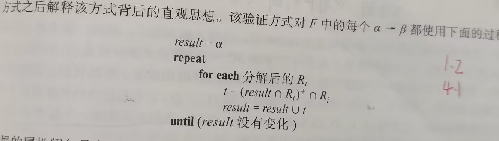

### 8.5 使用函数依赖的分解算法

#### 8.5.1 BCNF分解

BCNF检测：可以验证，如果F中没有依赖违反BCNF，那么$F^+$中也没有依赖违反BCNF

**BCNF分解**：

一开始分解集合为R,且R不满足BCNF,对于分解的集合中任意一个不满足BCNF的关系模式$R_i$，我们检查在$R_i$上所有的成立的非平凡函数依赖$\alpha \rightarrow \beta$(并且$\alpha \cap\beta=\empty$),用模式$R_i-\beta$和$(a,\beta)$去替换$\alpha \rightarrow \beta$,重复操作即可。

例子

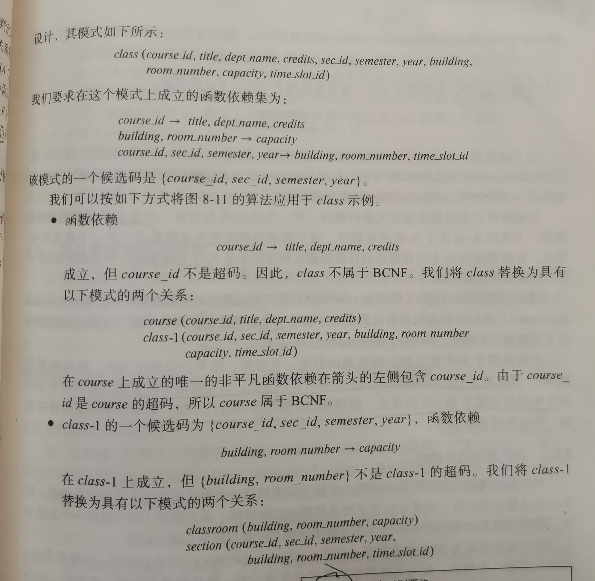

#### 8.5.2 3NF分解

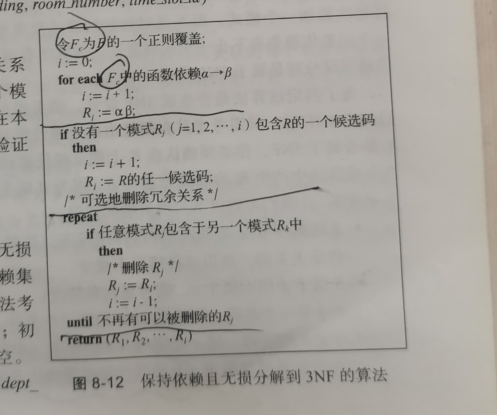

### 8.6 多值依赖(了解)

#### 8.6.1 多值依赖

若果$\beta\sube \alpha$或$\beta \cup \alpha=R$，则称$\alpha \rightarrow \rightarrow \beta$是平凡的多值依赖

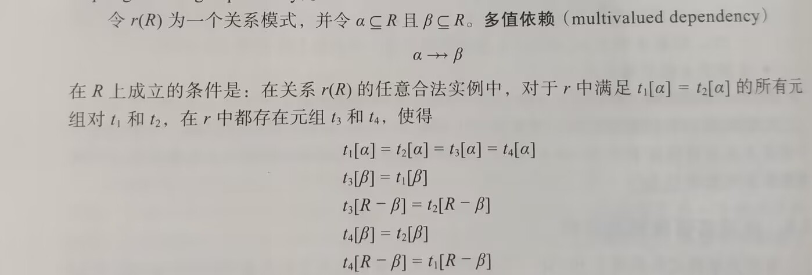

### 8.7 其他范式(2NF要了解一下，老教师可能出)

1NF:如果一个域的元素被认为是不可分割的单元，则称为时**原子的**。如果一个关系模式R的所有属性都是原子的，则R属于第一范式。

2NF:若存在a的一个真子集$\gamma$使得$\gamma \rightarrow \beta$，则函数依赖$\alpha \rightarrow \beta$被称为**部分依赖**，$\beta$被称为部分依赖于$\alpha$.

若R中的每个属性满足如下准则之一：

- 他没有出现在一个候选码中
- 他没有部分依赖于一个候选码

则称R满足第二范式。可以证明，满足3nf的一定满足2nf.（证明每个部分依赖是一个传递依赖）

4NF:对于$D^+$中的任意一个形如$\alpha \rightarrow \rightarrow \beta$的多值依赖，至少成立一下之一

- $\alpha \rightarrow \rightarrow \beta$是一个平凡的多值依赖
- $\alpha$是R的一个超码

## 第十二章 查询处理和查询优化

 ### 12.5 查询优化

给定一个查询，我们期望让系统构造一个能够让查询代价最小的查询执行计划，这就是查询优化。

算子树

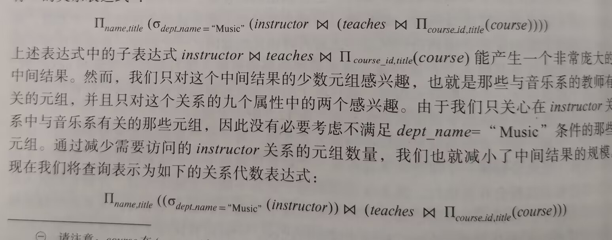

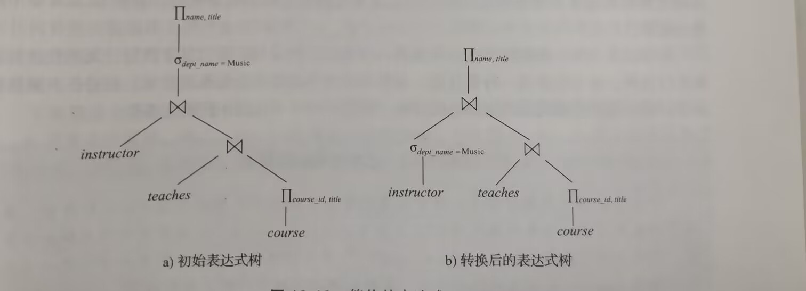

等价规则：两个关系代数的表达式在每个合法数据库上产生的结果元组都是一样的，则称二者是等价的。

1. 合取可以写成单个选择的运算序列
   $$
   \sigma_{\theta_1\wedge \theta_2}(E)\equiv \sigma_{\theta_1}(\sigma_{\theta_2}(E))
   $$

2. 选择满足交换律

$$
\sigma_{\theta_1}(\sigma_{\theta_2}(E))\equiv \sigma_{\theta_2}(\sigma_{\theta_1}(E))
$$
3. 一些列投影只有最后一个时必须的，称为$\Pi$的级联(学会逆着用)
   $$
   \Pi_{L_1}(\Pi_{L_2}...(\Pi_{L_n}(R)))\equiv\Pi_{L_1}\\
   其中L_1\sube\ L_2..\sube L_n
   $$

4.  选择运算可以和笛卡尔积以及$\theta$连接相结合
    $$
    \begin{align}
    &a.\ \ \sigma_\theta(E_1\times E_2)\equiv E_1\bowtie_\theta E_2（\theta连接的定义）\\
    &b.\ \ \sigma_{\theta_1}(E_1\bowtie_{\theta_2} E_2)\equiv   E_1\bowtie_{\theta_1\wedge\theta_2} E_2
    \end{align}
    $$
    
5.  $\theta$连接满足交换律

6.  自然连接满足结合律,$\theta$连接在下$\theta_2$只涉及到$E_2$和$E_3$属性时 也满足如下结合律
    $$
    (E_1\bowtie_{\theta_1} E_2)\bowtie_{\theta_2\wedge\theta_3}\equiv E_1\bowtie_{\theta_1\wedge\theta_3}(E_2\bowtie_{\theta_2} E_3)
    $$
    
7.  选择运算在下列两个条件对$\theta$连接满足分配率（用于选择早做）

    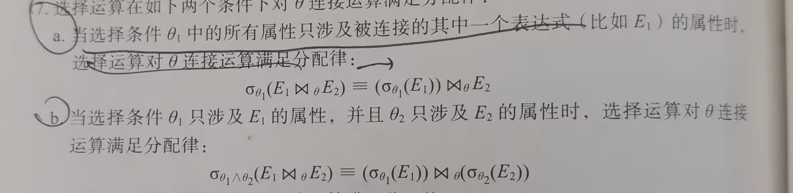

    

8.  投影运算对如下条件$\theta$连接满足分配率(用于投影早做)

    

    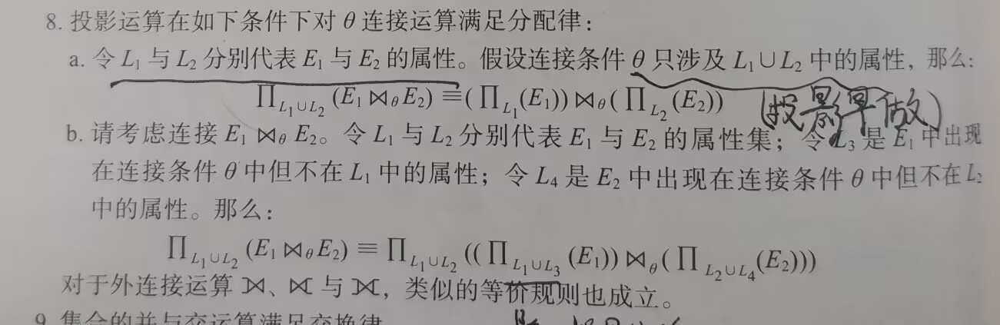

    对于b,$L_1\cup L_3$表示除了投影中的，还要带上选择条件中的属性

9. 集合的并与交满足交换律和结合律

10.   选择运算对交、并、差运算满足分配率

转换实例参考老师发过的一个PPT.

启发式的优化方法：

- 尽早执行选择
- 尽早执行投影

连接次序不同尽管可能是等价的，但是查询的代价不一定相同。

## 第十三章 事务管理

**事务：**访问并可能更新数据项的一个程序执行单元。

**事务的ACID特性**

- **原子性(atomicity)**：事物的所有操作要么全部反映出来，要么不反映
- **一致性(consistency):**其他三项都是为了实现事务的一致性，**所谓一致性是数据库处理前后结果应与其所抽象的客观世界中真实状况保持一致。确保一致性由**
- **隔离性(ioslation)：**事务正常执行而不被其他并行的语句干扰，对于每个事务而言，都感觉不到 其他事务正在并发的执行。
- **持久性(durability):**在一个事务完成之后，对数据库的修改必须是永久的，即使系统出错。

### 13.5 事务的隔离性

并发的好处

- 提高吞吐量和资源利用率
- 减少等待时间

**串行调度**：事务按照不同顺序执行。(指令不会交叉，一个事务的指令执行完了才会执行另一个事务)对于有n个事务的集合，有$n!$种串行调度方法。

**并发调度：**指令之间可以交叉。

并发执行的情况下，可能会出现不一致性，我们应该保证任何执行的调度效果与没有任何并发执行的调度效果一样，即调度应该等价于一个串行调度，这种调度被称为**可串行化**的。

### 13.6 可串行化(考试要考)

考虑两种最简单的事务Read和Write，设I,J分别为两种指令，若果I,J至少有一个时Write,则称I与J是**冲突的**。这里的冲突必须保证是针对**同一个数据项**，如事务I 的write(A)和j 的Read(A)是冲突的，与J的Read(B)则不是冲突的

如果调度S经过一些列非冲突指令的交换而转换成调度S',则称S和S'是**冲突等价**的。

若一个调度S与一个串行调度是冲突等价的，则称调度S是**冲突可串行化的**。

确定调度是否冲突可串行化的方法：构造优先图，$T_i\rightarrow T_j$等价于S的任何串行调度S'中，$T_i$必须出现在$T_j$之前。

如果优先图中有环，则是非冲突可串行化的，否则是冲突可串行化的。通过拓扑排序可以得到可串行化执行次序。

**视图可串行化：**看上去的效果是可串行化的。(课本）457)

对于任意数据项，满足一下三条，则称为**视图等价**：

1. 初值不变
2. 加工过程不变
3. 最终结果不变

### 13.7 事务的隔离性和原子性

#### 13.7.1 可恢复调度

一个可恢复调度是这样的一个调度：对于每个事务$T_i$和$T_j$，如果$T_j$读取了由$T_i$之前所写过的数据项，则对$T_i$的提交操作出现在$T_j$的提交操作之前。

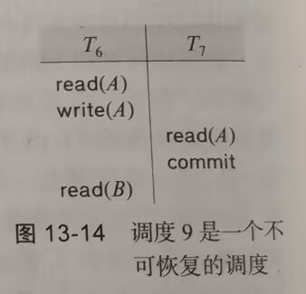

#### 13.7.2 无级联调度

因单个事务失效导致需要一系列事务回滚的现象称为级联回滚。

无级联调度：对于每对事务$T_i$和$T_j$,若$T_j$读取了$T_i$之前所写的一个数据项，那么对$T_i$的提交必须出现在$T_j$的读之前。

### 13.8 事务的隔离性级别

- 可串行化(serializable):通常保证可串行化的执行
- 可重复度(repeatable read):只允许读取已提交的数据，并进一步要求在一个事务两次读取一个数据项期间没其他事物不能更新该数据。
- 已提交读(read committed):只允许读取已提交的，但是并不要求可重复读。
- 未提交读(read uncommitted):允许读取未提交的数据。

以上所有隔离级别都不允许带有**脏写(dirty write)**.即如果一个数据项已经被另外一个尚未提交或者已经中止的事务写过，则不允许对该数据项再执行写操作。

## 第十四章 并发控制与恢复

### 14.1 基于锁的协议、

#### 14.1.1 锁

共享锁：lock-S(A),只能读，不能写

互斥锁：lock-X(A),事务既能读，又能写。

unlock(A):解开A上的互斥锁和排它锁。必须在合适位置释放锁，不然可能导致不能实现串行化。

由于锁的影响，有时候会发生**死锁**，这时候必须回滚两个事务中的一个。回滚后，被锁住的数据就被解锁。

系统中的每一事务必须遵从封锁协议，即事务何时可以对数据加锁和解锁。

#### 14.1.3 两段锁协议(考试重点)

该协议要求每个事务分成两个阶段提出加锁和解锁申请。

1. **增长阶段**：一个事务可以获得锁，但是不能释放任何锁
2. **缩减阶段**：一个事务可以释放锁，但是不能获得任何新锁。

可以证明，两段锁协议**确保了冲突可串行化**，但是**并不保证不会发送死锁**。

为了保证调度还是无级联的，引入了**严格两段锁协议**，该协议不仅要求封锁是两阶段的，还要求事务持有的X锁必须在事务提交后方可释放。这样任何一个未提交事务所写数据在事务提交前出于排他模式，不会被其他事务访问，从而是无级联的。

**强两段锁协议**：要求事务提交前必须保留所有的锁。

### 14.2 死锁处理

#### 14.2.1 死锁预防

1. 通过对锁请求进行排序(编号)，或要求同时获得所有的锁(一次分配所有的资源)来保证不会发生循环等待

2. 这种方法接近于死锁恢复，每当等待有可能导致死锁时，执行事务回滚而不是等待锁。(抢占与回滚)

   为了控制抢占，我们使用时间戳，有两种基于时间戳的死锁预防机制

   1. 等待-死亡(wait-die):是一种非抢占机制，仅当$T_i$的时间戳小于$T_j$(占有数据)的时间戳时（$T_i$更老），才允许$T_i$等待，否则应该回滚$T_i$，
   2. 伤害-等待(wound-wait):是一种抢占机制，与等待死亡相反，时间戳更大的才能等待小的事务的资源，否则应该回滚占有资源的事务(被伤害)

#### 14.2.2 死锁的检测和恢复

**检测**:使用**等待图**，一个事务$T_i$等待另一个事务$T_j$的资源，则连接一条有向边$T_i\rightarrow T_j$。如果等待关系不存在了，则删除边。若果等待图存环路，则发生了死锁。

**从死锁中恢复：** 解决死锁最常用的方法是回滚一个或多个事务，需要采取一下三个动作：

1. 选择牺牲者：选择回滚哪一个事务
2. 回滚：选择应该回滚多远。**完全回滚**：终止该事务。**部分回滚**：回滚到可以解除死锁。
3. 饿死：如果选择牺牲者是基于代价的，那么可能有一个事务总是被选择，从而永远不能发生，导致了饥饿现象。因此必须保证一个失误被选为牺牲者的次数是少数的。

### 14.7 多版本机制

在多版本机制中，每一个write(Q)产生一个Q的新版本，当事务发出read(Q)时，并发控制管理器选择Q的一个版本进行读取。并发控制机制必须保证对于读取的版本选择能够保证可串行化的方式进行。

- 多版本时间戳协议：
- 多版本两阶段封锁：

### 14.8 故障分类

恢复机制是数据库系统必不可少的部分，用来应对计算机系统的各种故障。

- 事务故障：分为逻辑错误和系统错误(死锁)
- 系统崩溃：硬件故障，或者是数据库或者操作系统的漏洞，容易导致易失性存储器内容丢失。
- 磁盘故障：数据库中的磁头损坏或者故障造成磁盘块中的内容丢失。可以通过拷贝恢复这种故障。

### 14.9 存储器

**易失性存储器**和**非易失性存储器**(磁盘)以及**稳定存储器。**

### 14.10 恢复与原子性(重点)

为了保持原子性的目标，我们必须在修改数据库本身之前，首先向稳定存储器输出信息，描述要做出的修改。

最常用的恢复技术是**基于日志的恢复**。还有一种称为**影子拷贝**的方法一般被用于记事本之类的文本编辑器。

#### 14.10.1 日志记录

日志是**日志记录**的序列，日子记录有很多种，**更新日志记录**的格式如下：

- 事务标识
- 数据标识项
- 旧值
- 新值

一般格式为：$<T_i,X_j,V_1,V_2>$,标识$T_i$对数据$X_j$执行写操作，旧值为$V_1$,新值为$V_2$

除了更新记录，还有其他记录，如：

- $<T_i\ start>$:s事务$T_i$开始
- $<T_i\ commit>$：事务$T_i$提交
- $<T_i\ abort>$:事务$T_i$中止

#### 14.10.2 数据库修改

如果一个事务执行了对磁盘缓冲块或磁盘本身的修改，我们说这个事务修改了数据库，而事务在主存中的私有部分进行的更新不算对数据库的修改。如果一个事务直到提交都没有修改数据库，我们说它使用了**延迟修改**；如果活跃中的事务就能修改数据库，我们说它使用了**立即修改**。

- 撤销操作(undo):使用一条日志记录，将该日志记录中指定数据项设置为日志记录包含的旧值。
- 重做操作(redo):使用一条日志记录，将该日志记录中指定的数据项设置为日志记录中包含的新值

#### 

#### 14.10.4 事务提交

当一个事务的commit日志记录(事务的最后一条日志记录)被输出到稳定存储器，我们就说这个事务提交了。此时表明更早的日志记录均被输出到稳定存储器了。若果崩溃发生在commit日志记录输之前，则该事务必须回滚。通过commit日子实现了原子性的输出。

#### 14.10.5 使用日志来重做和撤销事务

- $Redo(T_i)$:将事务的更新数据设置为新值
- $Undo(T_i)$：更新数据设置为旧值
  - 撤销不仅将值改成旧值，并且作为撤销过程的一部分，还应该写日志记录所做的更新，称为Redo-only日志记录，因为他们不需要包含旧值。
  - 对于事务$T_i$撤销操作结束后，写一条日志记录$<T_i\ abort>$，表示undo完成了。

如果事务被正常回滚，或者系统崩溃后既没有commit也没有abort,那么$undo(T_i)$对每个事务只执行一次。结果是，每个事务在日志中都有一条commit记录或者abort记录。

发生崩溃后，系统为了保证原子性，检查日志以确定哪些事务需要重做，哪些需要撤销。

- 如果日志中包含start,但没有commit或者abort，则需要撤销。
- 如果日志中包含了start记录，也有commit或者abort，则需要重做。(abort重做的是redo-only的操作)

一个例子

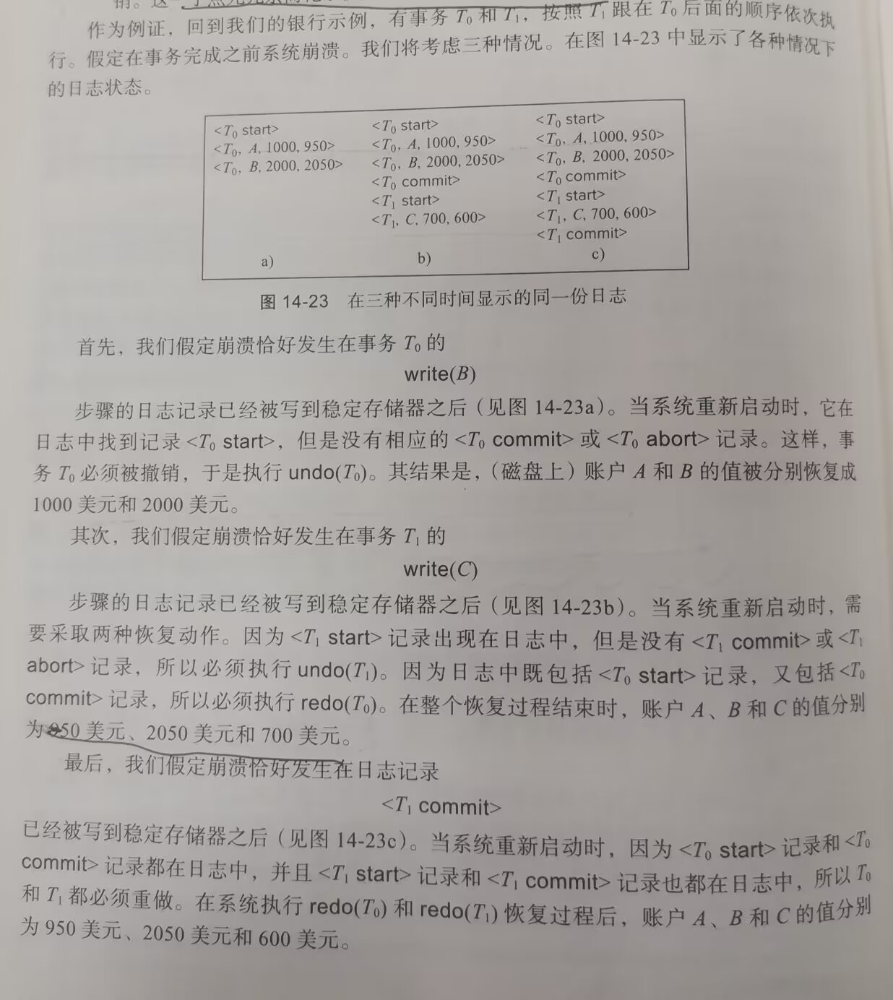

### 14.11 恢复算法(重点)

#### 14.11.1 事务回滚(正常回滚)

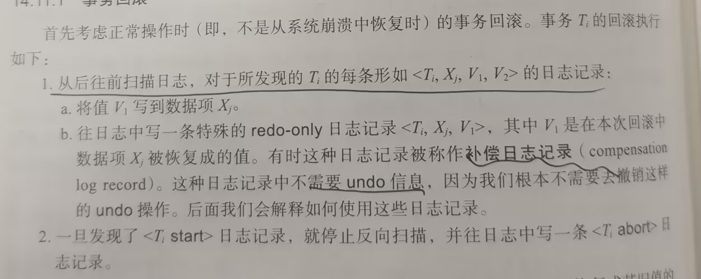

#### 14.11.2 系统崩溃后的恢复

恢复动作分为两个阶段：

- 重做阶段：系统从最后一个检查点开始正向扫描日志来重演所有事物的更新。
  1. 将待滚回滚的列表$undo-list$初始化为$<checkpoint\  L>$中的日志记录、
  2. 一旦遇到了$<T_iX_j,V_1,V_2>$，执行重做
  3. 一旦发现了$<T_i\ start>日志，将$T_i$加入$undo-list$
  4. 一旦发现$<T_i\ commit>$或者$<T_i\ abort>$,把$T_u$从$undo-list$中去除

经过redo阶段，undo-list中包括了需要撤销的事务。

- 撤销阶段：事务回滚undo-list中的所有事务，从尾端开始反向扫描日志记录。
  1. 一旦发现属于undo-list中的事务，执行撤销。
  2. 当发现了undo-list中的事务$T_i$的$<T_\ start>$，在日志中写一条$<T_i\ abort>$记录，并把$T_i$从undo-list中移除
  3. 一旦undo-list为空，撤销阶段结束。

一个例子：

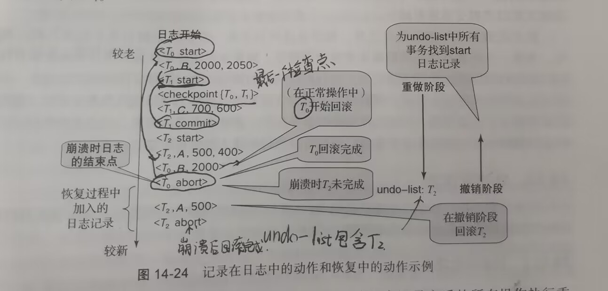
