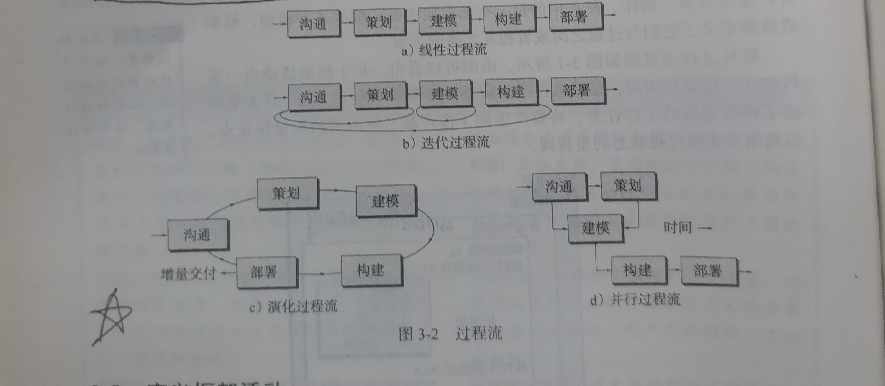
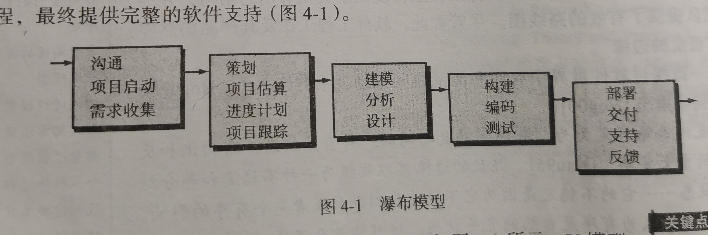
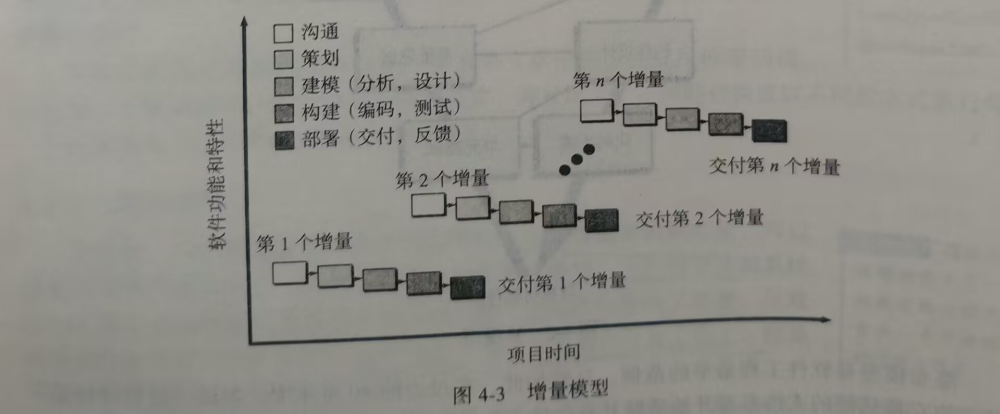
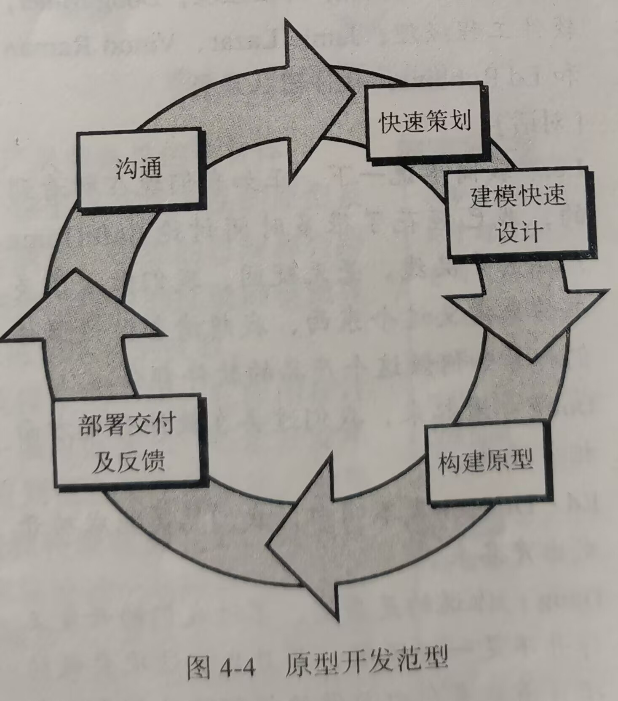
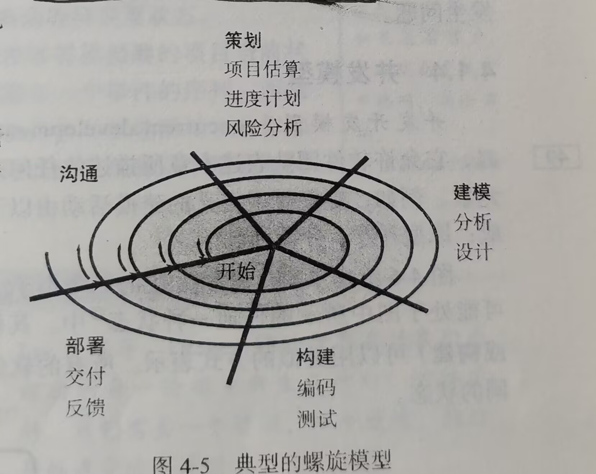
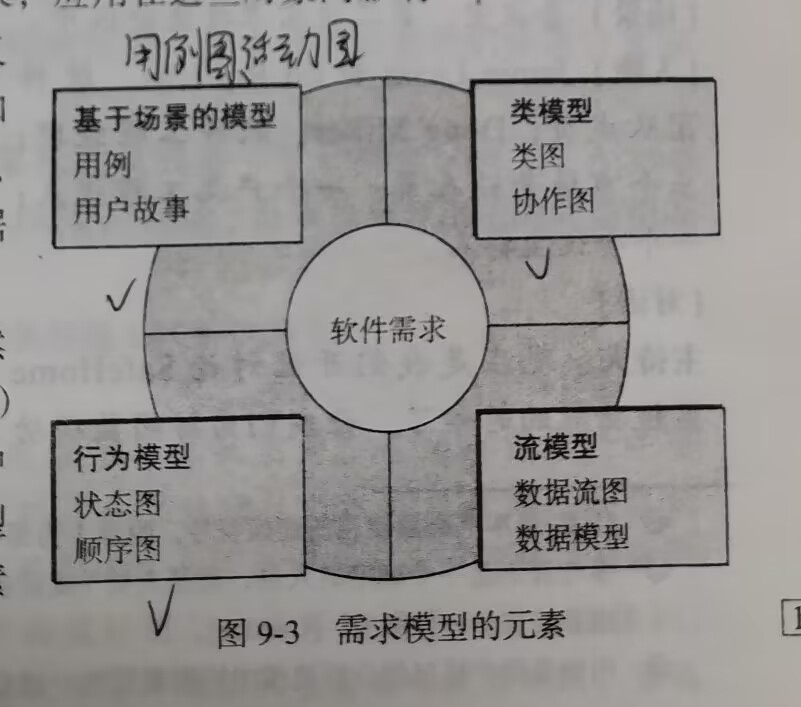
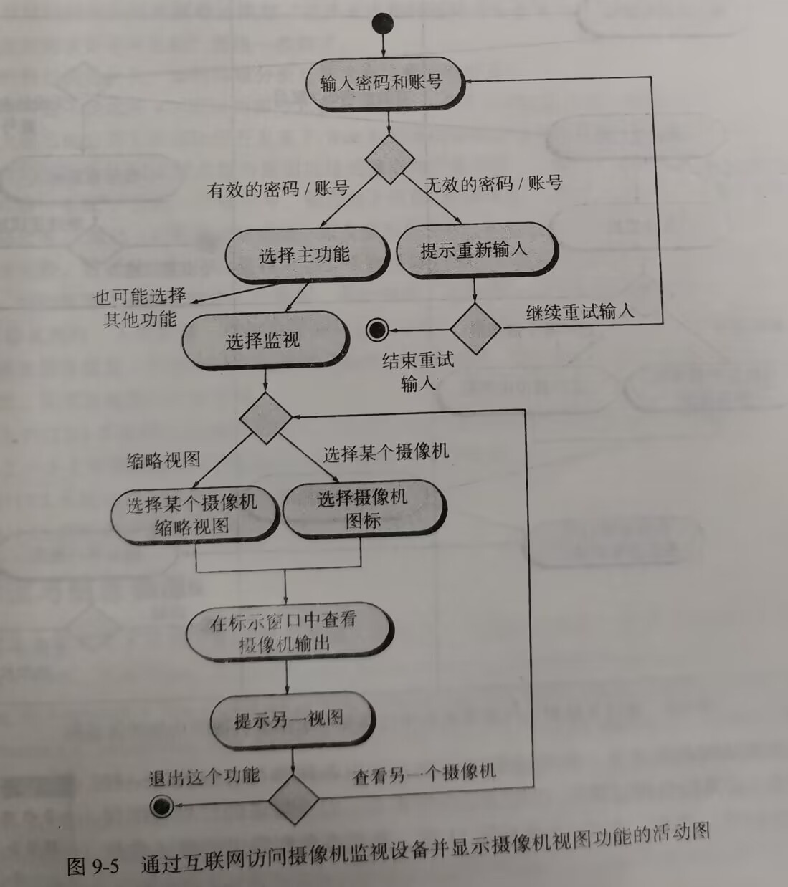
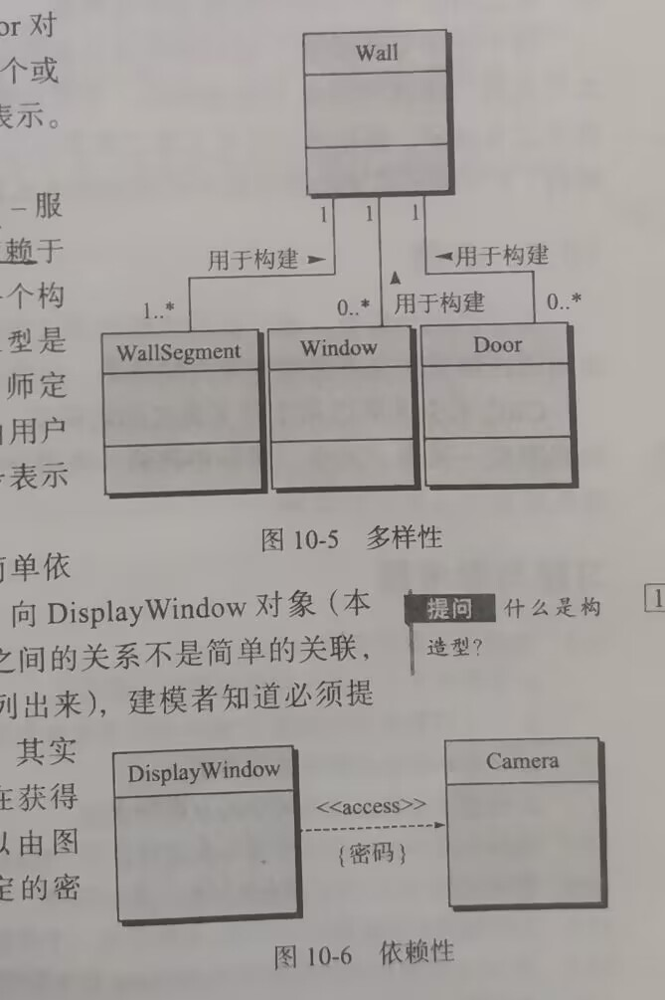

## 第一章 软件的本质

### 1.1 软件的本质

#### 1.1.1 定义软件

1. 指令的集合(计算机程序)，通过执行这些指令可以满足预期的特性、功能和性能需求。(programs)
2. 数据结构，使得程序可以合理利用信息（data）
3. 软件描述信息（document）

**软件硬件区别：**

1. 软件是被开发的或者设计的，它不是经典意义上被制造出来的

2. 随着时间的推移，因为尘土、振动、使用不当、温度超限制、以及其他一些环境问题，硬件效率会逐渐降低，即硬件会**磨损**

   而软件不会磨损，但会退化，由于软件生命周期，会面临许多变更，每次变更都可能引入新的错误，使得是失效率像实际曲线那样陡然上升。可以说，**不断地变更时软件退化的根本原因。**

3. 尽管该行业正在转向基于组件的构建，但大多数软件仍然是**定制的（custom-built）**。

#### 1.1.2 软件应用

- System software
- Application software
- Engineering/scientific software
- Embedded software 
- Product-line software
- Web/Mobile applications
- AI software (robotics, neural nets, game playing)

#### 1.1.3 遗留软件(legacy software)

各种久远的旧的软件系统称为**遗留软件。**

问题：质量差

**遗留系统进化的原因(Why must software change ?)**：

- Software must be **adapted to** meet the needs of new computing environments or 

technology.	

- Software must be **enhanced** to implement new business requirements.

- Software must be **extended** to make it interoperable with other more modern systems 

or databases.（软件必须扩展使之具有与更多新的系统和数据库的互操作能力）

- Software must be **re-architected** to make it viable within a network environment**.**(软件架构必须进行改建使之能适应不断演化的计算环境)

## 第二章 软件工程

### 2.1 软件工程的定义

1. 将**系统化的(systematic)、规范的(disciplined)、可量化(quantifiable)**的方法应用于软件的**开发(development)、运行（operation）和维(maintenance)**，即将工程化的方法应用于软件。
2. 对1中所述方法的研究。

软件工程是一种层次化的技术，从上到下依次是

- **tools(工具)**：为Process过程和Method方法提供支持

- **methods(方法)**：软件工程方法为构建软件提供技术上的解决办法

- **process(过程)**：

  - Is  the foundation of SW engineering to hold technology together to build software timely and rationally （及时地、合理地）
  - Defines  a framework  as a road map for software development
  - Forms a basis for software management control  

- **a quality focus(质量关注点)**：

  - 支持软件工程的根基(bedrock)在于质量关注点。

  - Is a organizational commitment to software
  - Need a continuous process improvement

### 2.2 软件过程

**定义：**``软件过程``是工作产品构建是所执行的一系列**活动(activity)**、**动作(action)和任务(task)**的集合。

- 活动主要实现宽泛的目标，(如与利益相关者进行沟通)，与应用领域、项目大小、结果复杂性没有直接关系
- 动作(如体系结构设计)包含了主要工作产品生产过程的一系列任务
- 任务关注小而明确的目标，能够生产实际产品(如构建一个单元测试)

#### 2.2.1 过程框架

**过程框架**定义了若干**框架活动**，为实现完整的软件工程过程建立了基础。这些活动广泛地适用于所有软件项目开发，无论项目的规模和复杂度如何。此外，过程框架还包含了整个软件过程的**普适性活动(umbrella activity)**。一个通用的软件工程过程框架通常包含一下5个活动：

- **沟通(communication)**
- **策划(planning)**
- **建模(modeling)**
- **构建(construction)**
- **部署(deployment)**

#### 2.2.2 普适性活动

贯穿项目始终，以帮助软件团队管理和控制项目进度、质量、变更和风险。

- 软件项目跟踪和控制
- 风险管理
- 软件质量保障
- 技术评审
- 测量
- 软件配置管理
- 可复用管理
- 工作产品的准备和生产

### 2.3 软件工程实践

#### 2.3.1 实践的精髓

- 理解问题(沟通和分析)

  - W**ho has a stake in the solution to the problem?** ：That is, who are the stakeholders(利益相关者)?
  - **What are the unknowns? (哪些是未知的)**：What data, functions, and features are required to properly solve the problem?
  - **Can the problem be compartmentalized?(问题可以划分吗)** ：Is it possible to represent smaller problems that may be easier to understand?（问题细化，区分）
  - **Can the problem be represented graphically? (问题可以图形化描述吗）**：Can an analysis model be created?(可视化、图形化)

- 策划解决方案(建模和软件设计)、

  - **Have you seen similar problems before?** 

    Are there patterns that are recognizable in a potential solution? Is there existing software that implements the data, functions, and features that are required? 

  - **Has a similar problem been solved?** 
    If so, are elements of the solution reusable?

  - **Can subproblems be defined(可以定义子问题吗)?** 
    If so, are solutions readily apparent for the subproblems?

  - **Can you represent a solution in a manner that leads to effective implementation?(能用一种很快实现的方式来描述解决方案吗？)** 
    Can a design model be created?

  

- 实施计划(代码生成)

  - **Does the solution conform to the plan?(解决方案和计划一致吗)** Is source code traceable to the design model?
  - **Is each component part of the solution provably correct?(解决方案的每个组成部分是否可以证明正确？)** Has the design and code been reviewed, or better, have correctness proofs been applied to algorithm?

- 检查结果正确性(测试和质量保障)

  - **Is it possible to test each component part of the solution?(能否测试解决方案的每一个部分？)** Has a reasonable testing strategy been implemented?
  - **Does the solution produce results that conform to the data, functions, and features that are required?(解决方案是否产生了与所要求的数据、功能、和特性一致性的结果？)**Has the software been validated against all stakeholder requirements?（满足需求）

#### 2.3.2 通用原则( Hooker’s General Principles)

1.  The Reason It All Exists(软件是否存在价值)
2.  KISS (Keep It Simple, Stupid!)（简单）
3.  Maintain the Vision（保持愿景，目标明确）
4.  What You Produce, Others Will Consume （关注使用者）
5.  Be Open to the Future（面向未来）  
6.  Plan Ahead for Reuse（重用）
7.  Think!（认真思考）

### 2.4 软件开发神话

- 管理神话(management myths)
- 客户神话(customer myths)
- 从业者神话(practitioner's myths)

## 第三章 软件过程结构

### 3.1 通用过程模型

**过程流**：过程流描述了在执行顺序和执行时间上，如何组织框架中的活动、动作和任务。

- 线性过程流：从沟通到部署顺序执行五个框架活动
- 迭代过程流：在执行下一个活动前**重复执行**之前的一个或多个活动
- 演化过程流：采用循环的方式执行各个活动，每次循环都能产生更为完善的软件版本
- 并行过程流：将一个或者多个活动与其他活动并行执行。

### 3.3 明确任务集

**任务集**定义了为完成软件工程操作的目标而要完成的实际工作。

每个任务集有以下构成:

- 软件工程工作任务
- 相关工作产品
- 质量保证点和项目里程碑

## 第四章 过程模型

### 4.1惯用过程模型(Prescriptive process models)

惯用过程模型力求达到软件开发的结构和秩序，其活动和任务都是按照过程的特定指引顺序进行的。是所有的软件过程模型都支持通用活动框架，只是每个模型对框架活动有不同侧重，并且定义不同的过程流以不同的方式执行每一个框架活动(包括动作和任务)

#### 4.1.1 瀑布模型(Waterfall Model)

采用线性过程流，要求**需求必须是准确定义的和相对稳定的。**

瀑布模型又被称为**经典生命周期模型(classic life cycle)**,它提出了一个系统的、顺序的软件开发方法，从用户需求规格说明开始，通过策划、建模、构建和部署的过程，最终提供完整的软件支持。

**优点：**

1. 在用户需求被很好定义的时候是一个有用并且相当稳定的过程模型。
2. 很好理解和策划
3. 它适用于易于理解的小型项目。
4. 分析和测试非常简单。

**缺点：**

1. 实际项目很少遵从顺序流，并且变更很容易造成混乱
2. 客户通常很难清楚地描述其需求
3. 客户必须要很有耐心，因为只有在项目接近尾声的时候，他们才可能得到可执行的程序。
4. 在审查工作计划之前，可能无法发现重大错误。
5. 由于任务之间的依赖性，导致花费在等待上的时间可能超过花费在工作中的时间。

#### 4.1.2 增量过程模型(The Incremental Model)

许多情况下，软件需求有明确定义，但是整个开发过程不宜单纯采用线性模型，同时，可能迫切需要为用户迅速提供一套功能有限的软件产品，然后在后续版本中不断细化和扩展功能，这就是增量过程模型。                        

**优点：**

- Useful for unavailable staffing for complete ，implementation by the business deadline.（克服人手不足）
- 节约时间.
- 线性（每个增量按照瀑布模型进行管理）+**并行**
- 每个增量都是可提交运行的版本，（**第一个增量往往是核心产品**core product）

**缺点：**

- 对于每次提交新的增量，早期的增量往往容易被忽略。

#### 4.1.3 演化过程模型（Evolutionary Models）

1**.原型过程模型(prototyping)**

虽然原型模型可以作为单独的过程模型，更多的还是作为一种方法，可以在任何一种过程模型中出现。原型模型开始于**沟通**。不论人们以什么方式运用它，当需求很模糊时，原型开发模型都能帮助开发人员和利益相关者更好地理解究竟需要做什么。（原型过程模型开发是为了尽快完成软件，开发者并没有考虑软件整体软件质量和长期可维护性，而只是将其快速开发可用。）

优点：

- 当**需求很模糊时**，原型开发模型都能帮助开发人员和利益相关者更好地理解究竟需要做什么。

缺点：

- 原型常常会被抛弃，而不是在其上继续开发,增加成本

- 客户通常会把原型当作工作产品，没有意识到**原型缺乏考虑整体质量和长期可维护性**，不愿重构整个系统，从而导致软件开发管理失效。()
- 一些凑合的技术和算法可能会遗留在最终系统中

**2.螺旋模型(Spiral Model)**

**螺旋模型**是一种演化过程模型，它结合了**原型的迭代性质**和**瀑布模型的系统性和可控性**，注重**风险控制（里程碑）**，**适合大型项目开发**(这是因为其他过程模型在软件交付后就结束了，螺旋模型则不同，它应用与计算机软甲的整个生命周期)。运用螺旋模型，把软件开发为一系列演进版本，早期的迭代中，软件可能是一个理论模型或原型，后来的迭代，才会产生一系列逐渐完善的系统版本
在每一次迭代的过程中，都要考虑风险(a risk-driven process model)、标记里程碑

螺旋模型沿着螺线旋转，自内向外每旋转一圈便开发出一个更完善的版本。

如果发现风险太大，项目可能终止。多数情况下沿着螺线的活动会继续下去，自内向外，逐步延伸，最终得到所期望的系统。

**优点：**                                                                                                                                                                                                                                                                                                                                                                                                                                                                                                                                                                                                                                                                                                                                                                                                                                                                                                                                                                                                                                                                                                                                                                   

- 采用循环的方式逐步加深系统定义和实现的深度,同时降低风险。
- 确定一系列里程碑，确保利益相关者认可是可行的且令各方满意的解决方案。

**缺点：**

-  依赖大量的风险评估专家来保障其成功。如果存在较大的风险没有被发现和管理，就肯定会发生问题。

### 4.3 统一过程(Unified Process)

特点

- use-case driven （用例驱动）
- architecture-centric （软件架构为核心）
- Risk Focused （关注风险）
- 迭代增量过程(an iterative and incremental development process.)
- 与统一建模语言 （UML） 紧密结合
- Inception(起始)/Elaboration(细化)/Construction(构建)/Transition(转换)（/production(生产) 

 

##  第五章 敏捷开发

### 5.1 什么是敏捷

  敏捷软件开发宣言：(The Manifesto for Agile Software Development)          

- **个人交互**胜过**过程工具**
- **可运行的软件**胜过了**复杂文档**
- **客户合作**胜过了**合同谈判**
- **对变更的良好响应**胜过了按部就班的**遵循计划。**

**什么是敏捷？**：有效的响应变更，快速增量的软件交付

- 快速交付（提交）产品（非护理中间工作产品）
- 对变化的有效（快速和适应性）响应
- 客户加入团队（消除“我们和他们”），所有利益相关者之间的有效沟通
- 项目计划必须灵活
- 组织一个团队，使其能够控制所执行的工作（自组织），轻松沟通

简而言之：快速、增量交付。

敏捷方法是克服传统软件工程中认识和实践的弱点而形成的，普遍存在的**变化**是敏捷的基本动力。

**为什么使用敏捷开发：**

- 克服传统 SE 中感知到的和实际的弱点。
- 可以提供重要的好处，但它们并不适用于所有项目、所有产品、所有情况
- 与可靠的 SE 实践并不对立。

### 5.2 敏捷及变更成本

### 5.3 敏捷过程

任何敏捷过程的特征都是一某种方式提出若干假设：

1.  提前预测哪些需求是稳定的以及哪些需求会变更是非常困难的。同 样，预测项目进行中客户优先级的变更也很困难。
2. 对很多软件来说，设计和构建是交错进行的。也就是两种活动应当 顺序开展以保证通过构建实施来验证设计模型，而在通过构建验证 之前很难估计应该设计到什么程度。
3. 分析、设计、构建和测试并不像我们所设想的那么容易预测（从制定计划的角度来看）

- 为了建立不可预测性的过程，敏捷过程必须有**可适应性**。
- 敏捷过程需要根据客户的反馈以作出适应性的改变，因此必须使用**增量式开发策略。**必须在短时间间隔内**交付软件增量**

**敏捷原则：**

并不是每一个敏捷过程模型都同等使用上述12条。

###  5.4 极限编程(XP,一种敏捷过程)

XP 使用面向对象方法作为推荐的开发泛型，是一种使用最广泛的敏捷过程。

四个**框架活动：**

- **策划(planning)**
  - 用户故事及其权重（优先级，软件增量）
  - 项目速度（一个发行版本中实现的故事数量，开发周数）
- **设计(designing)**
  - CRC卡方法
  - Spike解决方案：在某个故事的设计中遇到困难时，立即
  - 建立这部分设计的可执行原型，实现并评估。
  -  重构：不改变代码的外部行为而是改进其内部结构。
- **编码(coding)**
  - XP推荐在编码之前建立单元测试。
  -  结对编程
  -  持续集成(CI)是每日构建\每晚构建的一种极限形式，是XP的重要基础。
- **测试（testing)**
  -  在编码之前建立单元测试是XP的关键因素。
  -  每日构建
  -  验收测试根据用户故事确定

**pros:**

- 强调客户参与。
- 制定合理的计划和时间表。
- 开发人员对项目的高度承诺。
- 降低产品拒收的可能性。

**cons：**

- “运送”原型的诱惑。
- 需要经常开会讨论增加成本的问题。
- 允许过多的更改。
- 取决于高技能的团队成员。

###  5.5 其他敏捷过程模型

####  5.5.1 Scrum

完全遵循敏捷宣言，过程有“**需求、分析、设计、演化、交付"**

- Backlog（待定项）

  -  一个能为用户提供商业价值的项目需求或特征的优先级列表

  - 项目中待完成的工作列表

- Sprints （ 冲刺）

  - 一次迭代开发的时间周期
  - Scrum项目周期由一组迭代周期sprints组成
  - 典型的迭代周期为2-4周
  -  产品的设计，开发，测试全部都在一个迭代周期内完成

- Scrum master
  - 对项目的直接管理
  - 领导团队完成Scrum的实践以及体现其价值
  - 排除团队遇到的困难

- Scrum meetings（Scrum例会/ Scrum立会）
  - 每天都会开
  - 15分钟结束 
  - 站着开会
  - 三个问题：今天完成了什么？遇到了什么困难？ 明天要做什么？

- Demos 
  -  在预定的时间段内向客户交付软件增量、

**pros:**

- 产品负责人设定优先级。
- 团队拥有决策权。
- 文档是轻量级的。
- 支持频繁更新。

**cons：**

- 难以控制变更成本。
- 可能不适合大型团队。
- 需要专家团队成员。

##  第八章 理解需求

 ### 8.1 需求工程

**需求工程**是指致力于不断理解需求的大量任务和技术。从软件过程的角度来看，需求工程是一个软件工程动作，开始于沟通并持续到建模活动。他必须适用于过程、项目、产品和人员的需要。

**理解需求**是软件工程师所面临的最困难的任务之一。

需求工程包括如下七项任务：

-  Inception(起始)
- Elicitation(收集)
- Elaboration(细化)
- Negotiation(协商)
- Specification（规划说明）：需求规格说明书(SRS)是一份技术需求清单，描述系统功能、性能和约束的文档，可以用文字、图形、一组场景、形式化数学模型、一个原型等来表达需求
- Validation(确认)
-  Requirements Management(需求管理)

注意，某些是并行执行，并不是完全按顺序。

**需求三个层次：**

- 业务需求：反映了组织或客户高层次的目标要求，通常问题定义本身就是业务需求。
- 用户需求：描述要求系统必须完成的任务，即用户能使用系统来做些什么。用户需要是用户真正需要的东西，用户需求是用户对其需要的一种陈述，但这种陈述可能与它们的需要不一致。
- 功能需求：描述开发人员应在产品中实现的软件功能，用户利用这些功能来完成任务，满足业务需求。**功能需求是需求的主体**，其数量往往比用户需求高一个数量级。

**其他需求**：

- 质量需求 / 非功能性需求：产品必须具备的属性或品质，包括性能、安全性、可靠性和可测试性等

- 约束：对解决方案的一些约束说明，如操作系统、硬件环境等。
	
-  业务规则    

    

### 8.2 起始阶段

- 确认利益相关者(stakeholders):直接或者间接地从正在开发的系统中获利的人。
- 识别多重观点：由于存在许多不同的利益相关者，因此将从许多不同的角度探讨需求。应该标识公共区域和矛盾区域或不一致区域
- 协同合作：所有利益相关者都会分配到一定数量的优先点，然后在需求列表上，把优先点分配给自己认为重要的需求。每项需求的优先点总数显示了该需求的综合重要性。
- 首次提问：
- 非功能需求
- 可追溯性（Traceability）：软件工程工作产品间记录的链接(如需求和测试用例)

### 8.3 获取需求

**质量功能部署：(QFD)**:是一种将客户要求转化成软件技术需求的技术。目的是最**大限度地让客户从软件工程过程中感到满意**，为了达到这个目标，QFD强调“什么是对客户有价值的”，然后在整个工程活动这种部署这些价值。

- Normal requirements
- Expected requirements
- Exciting requirements

### 8.4 细化(开发用例，重点)

用例：就是场景，描述了能表达主体场景的“故事”

### 8.5 构建分析(需求)模型

分析模型中的元素：

- 基于场景的元素：从用户的视角描述系统。包括用例图，活动图
- 基于类的元素：类图，协作图
- 行为元素：状态图，序列图
- Flow-oriented elements（第八版取消）：数据流图

### 8.6 协商需求

双赢：利益相关者(主要指客户)的“赢”在于获得能满足客户大多数需要的系统或产品。而作为软件团队的一员，“赢”在于按找实际情况、在可实现的预算和时间期限内完成工作。

### 8.7 确认需求

当需求模型的每个元素都已完成创建后，需要检查一致性、是否有遗漏以及是否有歧义。确保需求模型准确反映利益相关者的需求，并为设计提供坚实的基础	

## 第九章 需求建模：基于场景的方法(重点)

### 9.1 需求分析

需求分析产生软件工作特征的规格说明，指明软件和其他系统元素的接口，规定软件必须满足的约束。

建模师应该关注做什么，而不是怎么做。

**需求分析经验原则(rules of Thumb)：**

- 不要陷入细节
- 增加对软件需求主体的理解
- 有些非功能的模型可以延后到设计阶段完成
- 确认需求模型对所有利益相关者带来价值
- 保持简洁

**需求建模方法**：

- 结构化分析:通过对数据处理的需求建模方法
- 面向对象的方法：UML和同一过程(UP)是主要的面向对象的方法。

###  9.2 基础场景的建模(重点）

基于场景的建模方法从用户的角度描述软件需求。用例是主要的建模元素，描述了参与者和软件之间的交互活动。为了开始开发一组用例，首先列出特定参与者执行的功能或活动。

用例模板（红色部分是必须有的）

###  9.3 补充用例UML模型

**UML活动图**：在特定场景通过提供迭代流的图形化表示来补充用例。

- **两端为半圆形的矩形**：表示系统功能。
- **箭头**：系统的流
- **菱形**：表示分支
- **实水平线**：表示并行发生的活动。
- 实黑圈表示活动开始，黑圈外面套一个圈表示活动结束。

活动图增加了额外的细节，这些细节用例无法描述(隐含的)

**UML泳道图：**是活动图的一种有用的变形，允许建模人员表示用例所描述的活动流，同时指出哪个**参与者**或**分析类**负责由活动矩形所描述的活动。

## 第十章 需求建模：基于类的方法

**面向对象**关键词：

- Classes and objects
- Attributes and operations(属性和方法)
- Encapsulation and instantiation(封装和实例)
- Inheritance继承、polymorphism多态（多态性是指相同的操作或函数、过程可作用于多种类型的对象上并获得不同的结果。不同的对象，收到同一消息可以产生不同的结果，这种现象称为多态性。）

### 10.1 识别分析类

**什么是类：**客观世界由对象组成，任何客观事物都是对象，复杂对象可以由简单对象组成。具有相同数据和操作的对象可归纳成类，对象是类的一个实例。

**可能的类**：

- 外部实体：如其他系统、设备、人员
- 事务：如报告、显示、字母、信号
- 偶发事件或事件
- 角色:经理、工程师
- 组织单元：部门、团队
- 场地：车间、码头
- 结构：传感器、计算机、汽车

决定类：

- **Retained information-保留信息**:只有在必须记住有关它的信息以便系统可以运行的情况下，潜在类在分析过程中才有用。
- **Needed services-所需服务**:潜在类必须具有一组可识别的操作，这些操作可以以某种方式更改其属性的值。
- **Multiple attributes-多个属性**:在需求分析过程中，重点应放在“主要”信息上;事实上，具有单个属性的类在设计过程中可能很有用，但在分析活动中可能更好地表示为另一个类的属性。
- **Common attributes-公共属性**.:可以为潜在类定义一组属性，这些属性适用于类的所有实例。
- **Common operations-公共操作**：可以为潜在类定义一组操作，这些操作适用于该类的所有实例。
- **Essential requirements-必要需求：**出现在问题空间中并生成或使用对系统的任何解决方案的操作至关重要的信息的外部实体几乎总是被定义为需求模型中的类。

潜在类应该全部或者几乎满足这些条件才能称为真正的类。

**类的组成：属性(attributes)和方法(operations)**

**类的关系：**

- 关联 Association
- 依赖 Dependency
- 泛化 Generalization
- 实现 Realization

### 10.4 类-职责-协作者建模(Class-Responsbility-Collaborator ,CRC)

CRC提供了一种简单的方法，用来识别或组织与系统产品需求相关的类。

**什么是CRC:**CRC模型是表示类的标准索引卡的集合。CRC卡包括三个基本部分：类、责任、协作者

- 类：
  - 实体类：也称业务类，是从问题说明中直接提取出来的。通常代表保存在数据库中和贯穿应用程序的事物
  - 边界类：用于创建用户可见的和在使用软件时交互的接口 
  - 控制类：
  - 管理
    - 实体类的创建或更新
    -  对象集合间的复杂通信
    - 对象间或用户和应用系统间交换数据的确认

-  职责：即属性和操作，SRP ：单一职责原则
- 协作：类用两种方法来实现职责，一种使用自身的操作控制各个属性实现职责，另一种是类之间的协作。

### 10.5 关联和依赖

关联：两个分析类以某种方式联系着。1..*表示0或者多个，1表示一个(类似于数据库中的映射关系表示)

依赖：一个类依赖于另一个类，建立了依赖关系。依赖是由一个构造型定义，由一个尖括号表示，可以自命名。

**关联和依赖图：**

### 10.6 分析包

分析包：用来集合一组相关的类。

## 第十一章 需求建模：行为、模式

之前的建模表示主要是表达需求模型的**静态元素**；本节主要是**动态行为**的建模

