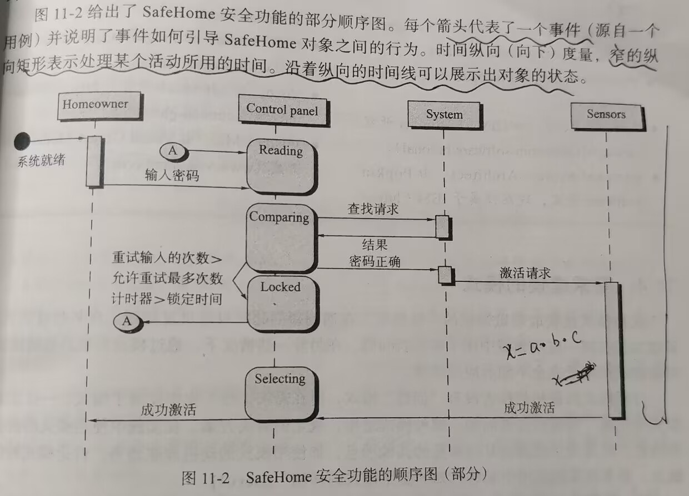
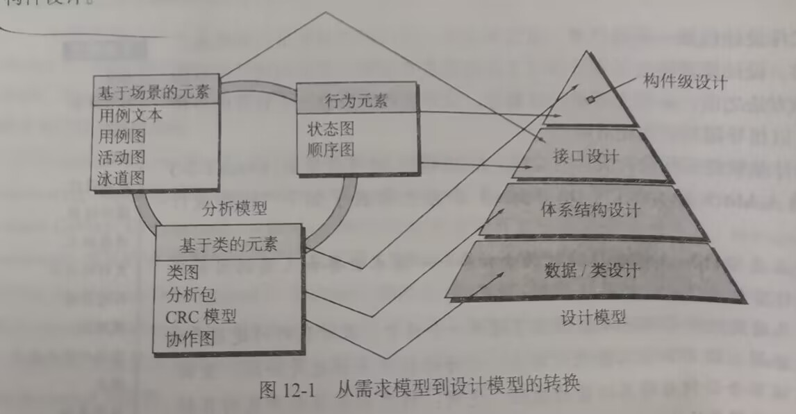
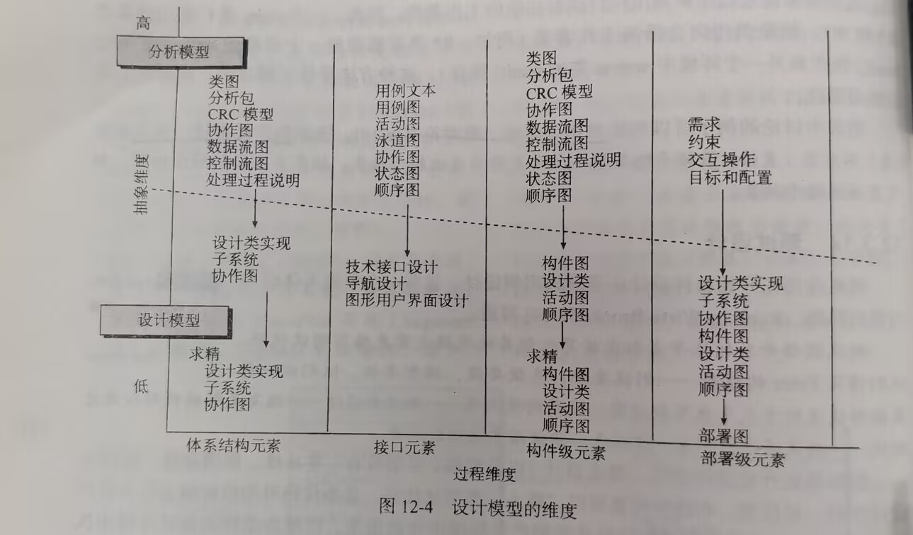
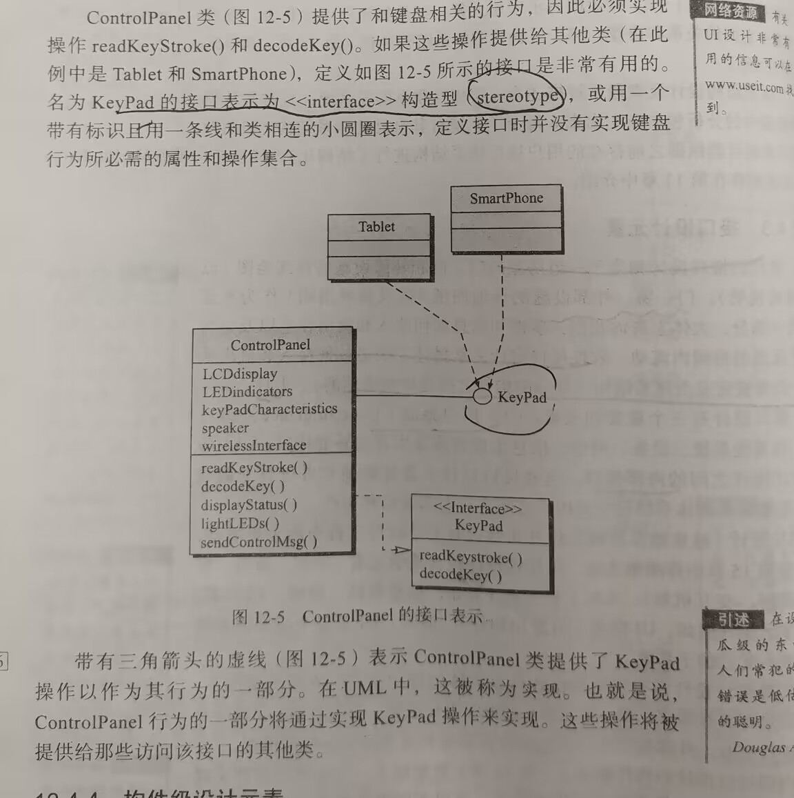
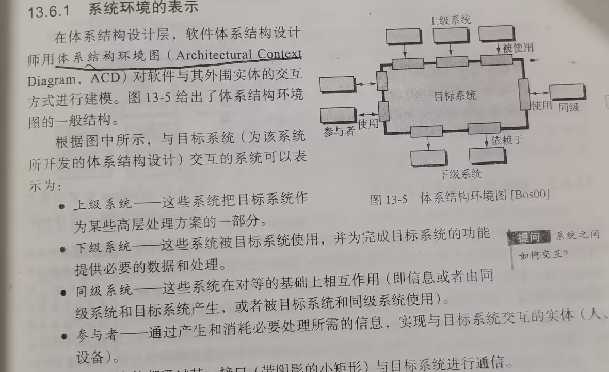
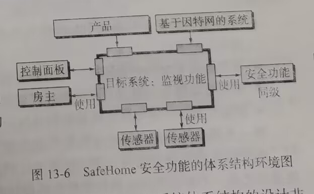
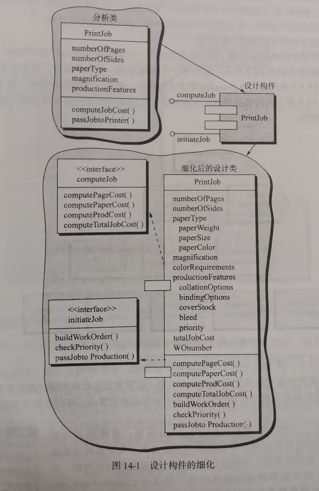
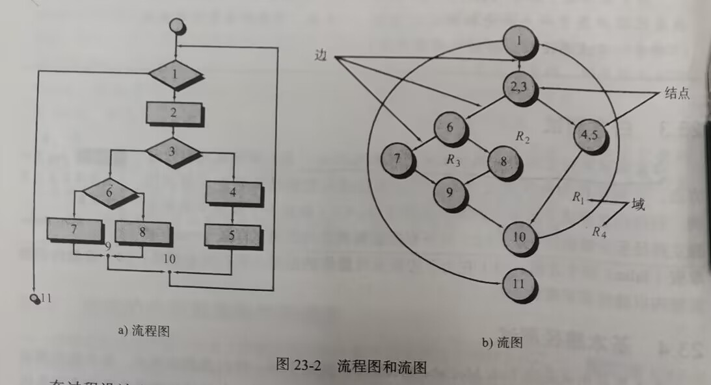
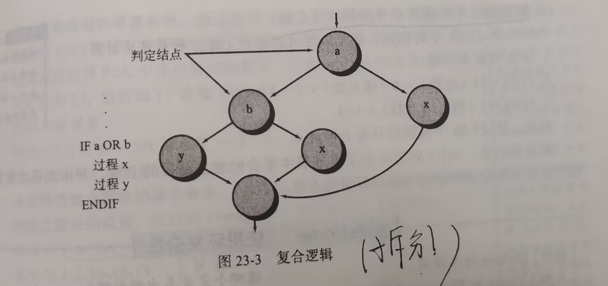

## 考试题型

1. 单项选择题20 （20*1）
2. 判断分析题10    (2*5）
3. 分析题10           (2*5)
4. 问答题30          （5*6）
5. 设计题30         （30)

## 第一章 软件的本质

### 1.1 软件的本质

#### 1.1.1 定义软件

1. 指令的集合(计算机程序,program)，通过执行这些指令可以满足预期的特性、功能和性能需求。(programs)
2. 数据结构，使得程序可以合理利用信息（data）
3. 软件描述信息（document）

**软件硬件区别：**

1. 软件是被开发的或者设计的，它不是经典意义上被制造出来的

2. 随着时间的推移，因为尘土、振动、使用不当、温度超限制、以及其他一些环境问题，硬件效率会逐渐降低，即硬件会**磨损**

   而软件不会磨损，但会退化，由于软件生命周期，会面临许多变更，每次变更都可能引入新的错误，使得是失效率像实际曲线那样陡然上升。可以说，**不断地变更时软件退化的根本原因。**

3. 尽管该行业正在转向基于组件的构建，但大多数软件仍然是**定制的（custom-built）**。


#### 1.1.2 软件应用

- System software
- Application software
- Engineering/scientific software
- Embedded software 
- Product-line software
- Web/Mobile applications
- AI software (robotics, neural nets, game playing)


#### 1.1.3 遗留软件(legacy software)

各种久远的旧的软件系统称为**遗留软件。**

问题：质量差

**遗留系统进化的原因(Why must software change ?)**：

- Software must be **adapted to** meet the needs of new computing environments or 

technology.	

- Software must be **enhanced** to implement new business requirements.

- Software must be **extended** to make it interoperable with other more modern systems 

or databases.（软件必须扩展使之具有与更多新的系统和数据库的互操作能力）

- Software must be **re-architected** to make it viable within a network environment**.**(软件架构必须进行改建使之能适应不断演化的计算环境)

## 第二章 软件工程


### 2.1 软件工程的定义

1. 将**系统化的(systematic)、规范的(disciplined)、可量化(quantifiable)**的方法应用于软件的**开发(development)、运行（operation）和维护(maintenance)**，即将工程化的方法应用于软件。
2. 对1中所述方法的研究。

软件工程是一种层次化的技术，从上到下依次是

- **tools(工具)**：为Process过程和Method方法提供支持

- **methods(方法)**：软件工程方法为构建软件提供技术上的解决办法

- **process(过程)**：

  - Is  the foundation of SW engineering to hold technology together to build software timely and rationally （及时地、合理地）
  - Defines  a framework  as a road map for software development
  - Forms a basis for software management control  

- **a quality focus(质量关注点)**：
  - 支持软件工程的根基(bedrock)在于质量关注点。
  
  - Is a organizational commitment to software
  - Need a continuous process improvement


### 2.2 软件过程

**定义：**``软件过程``是工作产品构建是所执行的一系列**活动(activity)**、**动作(action)和任务(task)**的集合。

- 活动主要实现宽泛的目标，(如与利益相关者进行沟通)，与应用领域、项目大小、结果复杂性没有直接关系
- 动作(如体系结构设计)包含了主要工作产品生产过程的一系列任务
- 任务关注小而明确的目标，能够构建一个单元测试)


#### 2.2.1 过程框架

**过程框架**定义了若干**框架活动**，为实现完整的软件工程过程建立了基础。这些活动**广泛地适用于所有软件项目开发**，无论项目的**规模和复杂度如何**。此外，过程框架还包含了整个软件过程的**普适性活动(umbrella activity)**。一个通用的软件工程过程框架通常包含以下5个活动：

- **沟通(communication)**
- **策划(planning)**
- **建模(modeling)**
- **构建(construction)**
- **部署(deployment)**

#### 2.2.2 普适性活动

贯穿项目始终，以帮助软件团队管理和控制项目进度、质量、变更和风险。

- 软件项目跟踪和控制
- 风险管理
- 软件质量保障
- 技术评审
- 测量
- 软件配置管理
- 可复用管理
- 工作产品的准备和生产


### 2.3 软件工程实践

#### 2.3.1 实践的精髓

- 理解问题(沟通和分析)

  - W**ho has a stake in the solution to the problem?** ：That is, who are the stakeholders(利益相关者)?
  - **What are the unknowns? (哪些是未知的)**：What data, functions, and features are required to properly solve the problem?
  - **Can the problem be compartmentalized?(问题可以划分吗)** ：Is it possible to represent smaller problems that may be easier to understand?（问题细化，区分）
  - **Can the problem be represented graphically? (问题可以图形化描述吗）**：Can an analysis model be created?(可视化、图形化)

- 策划解决方案(建模和软件设计)、

  - **Have you seen similar problems before?** 

    Are there patterns that are recognizable in a potential solution? Is there existing software that implements the data, functions, and features that are required? 

  - **Has a similar problem been solved?** 
    If so, are elements of the solution reusable?

  - **Can subproblems be defined(可以定义子问题吗)?** 
    If so, are solutions readily apparent for the subproblems?

  - **Can you represent a solution in a manner that leads to effective implementation?(能用一种很快实现的方式来描述解决方案吗？)** 
    Can a design model be created?

  

- 实施计划(代码生成)

  - **Does the solution conform to the plan?(解决方案和计划一致吗)** Is source code traceable to the design model?
  - **Is each component part of the solution provably correct?(解决方案的每个组成部分是否可以证明正确？)** Has the design and code been reviewed, or better, have correctness proofs been applied to algorithm?

- 检查结果正确性(测试和质量保障)

  - **Is it possible to test each component part of the solution?(能否测试解决方案的每一个部分？)** Has a reasonable testing strategy been implemented?
  - **Does the solution produce results that conform to the data, functions, and features that are required?(解决方案是否产生了与所要求的数据、功能、和特性一致性的结果？)**Has the software been validated against all stakeholder requirements?（满足需求）


#### 2.3.2 通用原则( Hooker’s General Principles)

1.  The Reason It All Exists(软件是否存在价值)
2.  KISS (Keep It Simple, Stupid!)（简单）
3.  Maintain the Vision（保持愿景，目标明确）
4.  What You Produce, Others Will Consume （关注使用者）
5.  Be Open to the Future（面向未来）  
6.  Plan Ahead for Reuse（重用）
7.  Think!（认真思考）


### 2.4 软件开发神话

- 管理神话(management myths)
- 客户神话(customer myths)
- 从业者神话(practitioner's myths)


## 第三章 软件过程结构


### 3.1 通用过程模型

**过程流**：过程流描述了在执行顺序和执行时间上，如何组织框架中的活动、动作和任务。

- 线性过程流：从沟通到部署顺序执行五个框架活动
- 迭代过程流：在执行下一个活动前**重复执行**之前的一个或多个活动
- 演化过程流：采用循环的方式执行各个活动，每次循环都能产生更为完善的软件版本
- 并行过程流：将一个或者多个活动与其他活动并行执行。


### 3.3 明确任务集

**任务集**定义了为完成软件工程操作的目标而要完成的实际工作。

每个任务集有以下构成:

- 软件工程工作任务
- 相关工作产品
- 质量保证点和项目里程碑

##### CMMI 

是一个综合的过程元模型，以一组系统工程和软件工程能力为基础，能够表示 组织可以到达的过程能力以及成熟度的不同等级。

## 第四章 过程模型

### 4.1惯用过程模型(Prescriptive process models)

惯用过程模型力求达到软件开发的结构和秩序，其活动和任务都是按照过程的特定指引顺序进行的。是所有的软件过程模型都支持通用活动框架，只是每个模型对框架活动有不同侧重，并且定义不同的过程流以不同的方式执行每一个框架活动(包括动作和任务)

#### 4.1.1 瀑布模型(Waterfall Model)

采用线性过程流，要求**需求必须是准确定义的和相对稳定的。**


瀑布模型又被称为**经典生命周期模型(classic life cycle)**,它提出了一个系统的、顺序的软件开发方法，从用户需求规格说明开始，通过策划、建模、构建和部署的过程，最终提供完整的软件支持。

**优点：**

1. 在用户需求被很好定义的时候是一个有用并且相当稳定的过程模型。
2. 很好理解和策划
3. 它适用于易于理解的小型项目。
4. 分析和测试非常简单。

**缺点：**

1. 实际项目很少遵从顺序流，并且变更很容易造成混乱
2. 客户通常很难清楚地描述其需求
3. 客户必须要很有耐心，因为只有在项目接近尾声的时候，他们才可能得到可执行的程序。
4. 在审查工作计划之前，可能无法发现重大错误。
5. 由于任务之间的依赖性，导致花费在等待上的时间可能超过花费在工作中的时间。


#### 4.1.2 增量过程模型(The Incremental Model)

许多情况下，**软件需求有明确定义，**但是整个开发过程不宜单纯采用线性模型，同时，可**能迫切需要**为用户迅速提供一套功能有限的软件产品，然后在后续版本中不断细化和扩展功能，这就是增量过程模型。                        

**优点：**

- Useful for unavailable staffing for complete ，implementation by the business deadline.（克服人手不足）
- 节约时间.
- 线性（每个增量按照瀑布模型进行管理）+**并行**
- 每个增量都是可提交运行的版本，（**第一个增量往往是核心产品**core product）
- 是对先先行过程模型的快速适应

**缺点：**

- 对于每次提交新的增量，**早期的增量往往容易被忽略。**


#### 4.1.3 演化过程模型（Evolutionary Models）

1**.原型过程模型(prototyping)**

虽然原型模型可以作为单独的过程模型，更多的还是作为一种方法，可以在任何一种过程模型中出现。原型模型开始于**沟通**。不论人们以什么方式运用它，当**需求很模糊时，原型开发模型都能帮助开发人员和利益相关者更好地理解究竟需要做什么。**（原型过程模型开发是为了尽快完成软件，开发者并**没有考虑软件整体软件质量和长期可维护性**，而只是将其快速开发可用。）

优点：

- 当**需求很模糊时**，原型开发模型都能帮助开发人员和利益相关者更好地理解究竟需要做什么。

缺点：

- 原型常常会被抛弃，而不是在其上继续开发,增加成本

- 客户通常会把原型当作工作产品，没有意识到**原型缺乏考虑整体质量和长期可维护性**，不愿重构整个系统，从而导致软件开发管理失效。
- 一些凑合的技术和算法可能会遗留在最终系统中


**2.螺旋模型(Spiral Model)**

**螺旋模型**是一种演化过程模型，它结合了**原型的迭代性质**和**瀑布模型的系统性和可控性**，注重**风险控制（里程碑）**，**适合大型项目开发**(这是因为其他过程模型在软件交付后就结束了，螺旋模型则不同，它应用与计算机软的整个生命周期)。运用螺旋模型，把软件开发为一系列演进版本，早期的迭代中，软件可能是一个理论模型或原型，后来的迭代，才会产生一系列逐渐完善的系统版本
在每一次迭代的过程中，都要考虑风险(a risk-driven process model)、标记里程碑


螺旋模型沿着螺线旋转，自内向外每旋转一圈便开发出一个更完善的版本。

如果发现风险太大，项目可能终止。多数情况下沿着螺线的活动会继续下去，自内向外，逐步延伸，最终得到所期望的系统。

**优点：**                                                                                                                                                                                                                                                                                                                                                                                                                                                                                                                                                                                                                                                                                                                                                                                                                                                                                                                                                                                                                                                                                                                                                                   

- 采用循环的方式逐步加深系统定义和实现的深度,同时降低风险。
- 确定一系列里程碑，确保利益相关者认可是可行的且令各方满意的解决方案。

**缺点：**

-  依赖大量的风险评估专家来保障其成功。如果存在较大的风险没有被发现和管理，就肯定会发生问题。


### 4.3 统一过程(Unified Process)

不仅仅是一个简单的软件过程，而是一个通用的过程框架，可用于不同类型的应用系统、各种不同的应用领域、各种不同类型的组织、各种不同功能和规模的项目。它是基于构件（Component-based）的，即所构造的软件系统是由软件构件通过明确定义的接口相互链接所建造起来的。并且它使用统一建模语言（Unified Modeling Language，UML）来制定系统的所有蓝图。

**统一软件过程的特点：用例驱动、以构架为中心、迭代和增量的软件过程框架。**

特点

- use-case driven （用例驱动）
- architecture-centric （软件架构为核心）
- Risk Focused （关注风险）
- 迭代增量过程(an iterative and incremental development process.)
- 与统一建模语言 （UML） 紧密结合
- Inception(起始)/Elaboration(细化)/Construction(构建)/Transition(转换)（/production(生产) 

 


##  第五章 敏捷开发

### 5.1 什么是敏捷

  敏捷软件开发宣言：(The Manifesto for Agile Software Development)          

- **个人交互**胜过**过程工具**
- **可运行的软件**胜过了**复杂文档**
- **客户合作**胜过了**合同谈判**
- **对变更的良好响应**胜过了按部就班的**遵循计划。**


**什么是敏捷？**：有效的响应变更，快速增量的软件交付

- 快速交付（提交）产品（非护理中间工作产品）
- 对变化的有效（快速和适应性）响应
- 客户加入团队（消除“我们和他们”），所有利益相关者之间的有效沟通
- 项目计划必须灵活
- 组织一个团队，使其能够控制所执行的工作（自组织），轻松沟通

简而言之：快速、增量交付。

敏捷方法是克服传统软件工程中认 的，普遍存在的**变化**是敏捷的基本动力。


**为什么使用敏捷开发：**

- 克服传统 SE 中感知到的和实际的弱点。
- 可以提供重要的好处，但它们并不适用于所有项目、所有产品、所有情况
- 与可靠的 SE 实践并不对立。

### 5.2 敏捷及变更成本


### 5.3 敏捷过程

任何敏捷过程的特征都是一某种方式提出若干假设：

1.  提前预测哪些需求是稳定的以及哪些需求会变更是非常困难的。同 样，预测项目进行中客户优先级的变更也很困难。
2. 对很多软件来说，设计和构建是交错进行的。也就是两种活动应当 顺序开展以保证通过构建实施来验证设计模型，而在通过构建验证 之前很难估计应该设计到什么程度。
3. 分析、设计、构建和测试并不像我们所设想的那么容易预测（从制定计划的角度来看）

- 为了建立不可预测性的过程，敏捷过程必须有**可适应性**。
- 敏捷过程需要根据客户的反馈以作出适应性的改变，因此必须使用**增量式开发策略。**必须在短时间间隔内**交付软件增量**

**敏捷原则：**


并不是每一个敏捷过程模型都同等使用上述12条。


###  5.4 极限编程(XP,一种敏捷过程)

XP 使用**面向对象方法**作为推荐的开发泛型，是一种使用最广泛的敏捷过程。


四个**框架活动：**

- **策划(planning)**
  - 用户故事及其权重（优先级，软件增量）
  - 项目速度（一个发行版本中实现的故事数量，开发周数）
- **设计(designing)**
  - CRC卡方法
  - Spike解决方案：在某个故事的设计中遇到困难时，立即
  - 建立这部分设计的可执行原型，实现并评估。
  -  重构：不改变代码的外部行为而是改进其内部结构。
- **编码(coding)**
  - XP推荐在编码之前建立单元测试。
  -  结对编程
  -  持续集成(CI)是每日构建每晚构建的一种极限形式，是XP的重要基础。
- **测试（testing)**
  -  在编码之前建立单元测试是XP的关键因素。
  -  每日构建
  -  验收测试根据用户故事确定


**pros:**

- 强调客户参与。
- 制定合理的计划和时间表。
- 开发人员对项目的高度承诺。
- 降低产品拒收的可能性。

**cons：**

- “运送”原型的诱惑。
- 需要经常开会讨论增加成本的问题。
- 允许过多的更改。
- 取决于高技能的团队成员。


###  5.5 其他敏捷过程模型

####  5.5.1 Scrum

完全遵循敏捷宣言，过程有“**需求、分析、设计、演化、交付"**


- Backlog（待定项）

  -  一个能为用户提供商业价值的项目需求或特征的优先级列表

  - 项目中待完成的工作列表

- Sprints （ 冲刺）

  - 一次迭代开发的时间周期
  - Scrum项目周期由一组迭代周期sprints组成
  - 典型的迭代周期为2-4周
  -  产品的设计，开发，测试全部都在一个迭代周期内完成

- Scrum master
  - 对项目的直接管理
  - 领导团队完成Scrum的实践以及体现其价值
  - 排除团队遇到的困难

- Scrum meetings（Scrum例会/ Scrum立会）
  - 每天都会开
  - 15分钟结束 
  - 站着开会
  - 三个问题：今天完成了什么？遇到了什么困难？ 明天要做什么？

- Demos 
  -  在预定的时间段内向客户交付软件增量、

**pros:**

- 产品负责人设定优先级。
- 团队拥有决策权。
- 文档是轻量级的。
- 支持频繁更新。

**cons：**

- 难以控制变更成本。
- 可能不适合大型团队。
- 需要专家团队成员。


##  第八章 理解需求


 ### 8.1 需求工程

**需求工程**是指致力于不断理解需求的大量任务和技术。从软件过程的角度来看，需求工程是一个软件工程动作，开始于沟通并持续到建模活动。他必须适用于过程、项目、产品和人员的需要。

**理解需求**是软件工程师所面临的最困难的任务之一。

需求工程包括如下七项任务：

-  Inception(起始)
- Elicitation(收集)
- Elaboration(细化)
- Negotiation(协商)
- Specification（规划说明）：需求规格说明书(SRS)是一份技术需求清单，描述系统功能、性能和约束的文档，可以用文字、图形、一组场景、形式化数学模型、一个原型等来表达需求
- Validation(确认)
-  Requirements Management(需求管理)

注意，某些是并行执行，并不是完全按顺序。

**需求三个层次：**

- 业务需求：反映了组织或客户高层次的目标要求，通常问题定义本身就是业务需求。
- 用户需求：描述要求系统必须完成的任务，即用户能使用系统来做些什么。用户需要是用户真正需要的东西，用户需求是用户对其需要的一种陈述，但这种陈述可能与它们的需要不一致。
- 功能需求：描述开发人员应在产品中实现的软件功能，用户利用这些功能来完成任务，满足业务需求。**功能需求是需求的主体**，其数量往往比用户需求高一个数量级。


**其他需求**：

- 质量需求 / 非功能性需求：产品必须具备的属性或品质，包括性能、安全性、可靠性和可测试性等

- 约束：对解决方案的一些约束说明，如操作系统、硬件环境等。
	
-  业务规则    

    

### 8.2 起始阶段

- 确认利益相关者(stakeholders):直接或者间接地从正在开发的系统中获利的人。
- 识别多重观点：由于存在许多不同的利益相关者，因此将从许多不同的角度探讨需求。应该标识公共区域和矛盾区域或不一致区域
- 协同合作：所有利益相关者都会分配到一定数量的优先点，然后在需求列表上，把优先点分配给自己认为重要的需求。每项需求的优先点总数显示了该需求的综合重要性。
- 首次提问：
- 非功能需求
- 可追溯性（Traceability）：软件工程工作产品间记录的链接(如需求和测试用例)


### 8.3 获取需求

**质量功能部署：(QFD)**:是一种将客户要求转化成软件技术需求的技术。目的是最**大限度地让客户从软件工程过程中感到满意**，为了达到这个目标，QFD强调“什么是对客户有价值的”，然后在整个工程活动这种部署这些价值。

- Normal requirements
- Expected requirements
- Exciting requirements

### 8.4 细化(开发用例，重点)

用例：就是场景，描述了能表达主体场景的“故事”

### 8.5 构建分析(需求)模型

分析模型中的元素：

- 基于场景的元素：从用户的视角描述系统。包括用例图，活动图
- 基于类的元素：类图，协作图
- 行为元素：状态图，序列图
- Flow-oriented elements（面向流的元素。第八版取消）：数据流图

### 8.6 协商需求

双赢：利益相关者(主要指客户)的“赢”在于获得能满足客户大多数需要的系统或产品。而作为软件团队的一员，“赢”在于按照实际情况、在可实现的预算和时间期限内完成工作。

### 8.7 确认需求

当需求模型的每个元素都已完成创建后，需要检查一致性、是否有遗漏以及是否有歧义。确保需求模型准确反映利益相关者的需求，并为设计提供坚实的基础	


## 第九章 需求建模：基于场景的方法(重点)


### 9.1 需求分析

需求分析产生软件工作特征的规格说明，指明软件和其他系统元素的接口，规定软件必须满足的约束。

建模师应该关注做什么，而不是怎么做。


**需求分析经验原则(rules of Thumb)：**

- 不要陷入细节
- 增加对软件需求主体的理解
- 有些非功能的模型可以延后到设计阶段完成
- 确认需求模型对所有利益相关者带来价值
- 保持简洁

**需求建模方法**：

- 结构化分析:通过对数据处理的需求建模方法
- 面向对象的方法：UML和同一过程(UP)是主要的面向对象的方法。


###  9.2 基础场景的建模(重点）

基于场景的建模方法从用户的角度描述软件需求。用例是主要的建模元素，描述了参与者和软件之间的交互活动。为了开始开发一组用例，首先列出特定参与者执行的功能或活动。

用例模板（红色部分是必须有的）


###  9.3 补充用例UML模型

**UML活动图**：在特定场景通过提供迭代流的图形化表示来补充用例。

- **两端为半圆形的矩形**：表示系统功能。
- **箭头**：系统的流
- **菱形**：表示分支
- **实水平线**：表示并行发生的活动。
- 实黑圈表示活动开始，黑圈外面套一个圈表示活动结束。


活动图增加了额外的细节，这些细节用例无法描述(隐含的)

**UML泳道图：**是活动图的一种有用的变形，允许建模人员表示用例所描述的活动流，同时指出哪个**参与者**或**分析类**负责由活动矩形所描述的活动。


## 第十章 需求建模：基于类的方法

**面向对象**关键词：

- Classes and objects
- Attributes and operations(属性和方法)
- Encapsulation and instantiation(封装和实例)
- Inheritance继承、polymorphism多态（多态性是指相同的操作或函数、过程可作用于多种类型的对象上并获得不同的结果。不同的对象，收到同一消息可以产生不同的结果，这种现象称为多态性。）


### 10.1 识别分析类

**什么是类：**客观世界由对象组成，任何客观事物都是对象，复杂对象可以由简单对象组成。具有相同数据和操作的对象可归纳成类，对象是类的一个实例。

**可能的类**：

- 外部实体：如其他系统、设备、人员
- 事务：如报告、显示、字母、信号
- 偶发事件或事件
- 角色:经理、工程师
- 组织单元：部门、团队
- 场地：车间、码头
- 结构：传感器、计算机、汽车

决定类：

- **Retained information-保留信息**:只有在必须记住有关它的信息以便系统可以运行的情况下，潜在类在分析过程中才有用。
- **Needed services-所需服务**:潜在类必须具有一组可识别的操作，这些操作可以以某种方式更改其属性的值。
- **Multiple attributes-多个属性**:在需求分析过程中，重点应放在“主要”信息上;事实上，具有单个属性的类在设计过程中可能很有用，但在分析活动中可能更好地表示为另一个类的属性。
- **Common attributes-公共属性**.:可以为潜在类定义一组属性，这些属性适用于类的所有实例。
- **Common operations-公共操作**：可以为潜在类定义一组操作，这些操作适用于该类的所有实例。
- **Essential requirements-必要需求：**出现在问题空间中并生成或使用对系统的任何解决方案的操作至关重要的信息的外部实体几乎总是被定义为需求模型中的类。

潜在类应该全部或者几乎满足这些条件才能称为真正的类。

**类的组成：属性(attributes)和方法(operations)**

**类的关系：**

- 关联 Association
- 依赖 Dependency
- 泛化 Generalization(继承)
- 实现 Realization(和继承差不多，用虚线表示)


### 10.4 类-职责-协作者建模(Class-Responsbility-Collaborator ,CRC)

CRC提供了一种简单的方法，用来识别或组织与系统产品需求相关的类。

**什么是CRC:**CRC模型是表示类的标准索引卡的集合。CRC卡包括三个基本部分：类、责任、协作者

- 类：
  - 实体类：也称业务类，是从问题说明中直接提取出来的。通常代表保存在数据库中和贯穿应用程序的事物
  - 边界类：用于创建用户可见的和在使用软件时交互的接口 
  - 控制类：
  - 管理
    - 实体类的创建或更新
    -  对象集合间的复杂通信
    - 对象间或用户和应用系统间交换数据的确认

-  职责：即属性和操作，SRP ：单一职责原则
- 协作：类用两种方法来实现职责，一种使用自身的操作控制各个属性实现职责，另一种是类之间的协作。


### 10.5 关联和依赖

关联：两个分析类以某种方式联系着。1..*表示0或者多个，1表示一个(类似于数据库中的映射关系表示)

依赖：一个类依赖于另一个类，建立了依赖关系。依赖是由一个构造型定义，由一个尖括号表示，可以自命名。

**关联和依赖图：**


### 10.6 分析包

分析包：用来集合一组相关的类。


## 第十一章 需求建模：行为、模式

### 11.1 生成行为模型

之前的建模表示主要是表达需求模型的**静态元素**；本节主要是**动态行为**的建模。

行为模型显示了软件如何对外部事件或激励作出响应。

行为模型采用基于场景、面向流和基于类的输入，从而把分析类和系统的状态作为一个整体表示。为了达到这一目的，必须识别状态，定义引起类(或系统)由一个状态到另一个状态的是事件，还要识别完成转化后发生的活动。

步骤：

1. 评估所有用例，以保证完全理解系统内的交互顺序
2. 识别驱动交互顺序的事件，并理解这些时间如何和特定的对象相互关联
3. 为每个用例生成序列
4. 创建系统状态图
5. 评审行为模型一验证准确性和一致性

### 11.3 状态表示

两种状态：每个类的状态和系统执行功能时外部观察到的状态

类状态具有**主动状态**和**被动(属性状态)状态**。

**分析类的状态图：**为**每个类**呈现了主动状态和导致这些主动状态发生变化的因素。


不是每一个类都需要用状态图来描绘它的行为，只针对具有明显的状态特征并且具有比较复杂的状态—事件—响应行为的类，才需要画状态图


**顺序图：**表明事件如何引发从一个对象到另一对象的转移，顺序图是用例图速记版本，他表现了让导致行为从一个类流到另一个类的关键类和事件。

垂直：从上而下表示消息/调用发生的时间序列，
水平：从左到右表示消息发送到的对象实例。



**时序图VS状态图**

- 状态图描述了系统的状态，并显示事件如何影响系统状态。
  - 序列图指示事件如何导致对象之间的转换。

此外活动图和泳道图(Swimlane Diagram)也可以用来表示行为模型。


## 第十二章 设计概念

###  12.1 软件工程中的设计

**软件设计**：包括**数据/类设计**、**体系结构设计**、**接口设计**和**构件设计**。
软件设计是软件工程中一个非常重要的阶段，处于技术核心(它是建模活动的最后一个软件工程活动)，它依据需求建模完成设计，并为编码（构造）提供技术规范和设计指导。软件设计的目的是为了保证**质量**
软件设计是一个迭代的过程，概要设计到详细设计。软件设计体现了创造性。



- Data/Class design ： 将分析类转换为相应类的实现和数据结构，主要从数据和类的需求建模中导出设计
- Architectural design ： 定义主要软件结构元素之间的关系，可以直接从需求模型导出，也可以从很多设计模式中导出
  (e.g. B/S C/S embedded-sys)
- Interface design ：描述了软件如何与与之互操作的系统以及使用它的人进行通信。场景和行为模型为接口提供了大量的信息。
- Component-level design ：将软件体系结构的结构元素转换为软件组件的过程描述。从基于类的模型、流模型和行为模型中获取的信息是组件设计的基础。


###  12.2 设计过程

软件设计是一个迭代过程，通过该过程，需求被转化为构建软件的“蓝图”。
最初，该设计表示一个高度的抽象 - 一个可以直接追溯到特定系统目标和更详细的数据，功能和行为要求的级别
随着设计迭代的发生，随后的细化会导致设计表示在低得多的抽象级别

#### 12.2.1 软件质量指导原则和属性

指导良好设计演化的三个特征

- 设计应当实现包含在需求模型中的明确需求，而且必须满足利益相关者期望的所有隐含需求。
- 易读、易懂，容易生成代码。（详细设计）
- 应提供软件的全貌，从实现的角度说明:数据、功能和行为域。(概要设计)


质量指导原则


**质量属性(FURPS ,重点掌握)**：

- Functionality 功能性
- Usability 易用性
- Reliability 可靠性
- Performance-高性能processing speed/response time/resource consumption/throughput(吞吐量)/efficiency
- Supportability- 可支持性（可维护、可测试、兼容、可配置、简易性等）
  - maintainability/testability/compatibility/
  - Configurability-the ability to organize and control elements of the software configuration
  - Convenient Installation
  - Locate problems easily

### 12.3 设计概念

#### 12.3 1 抽象

``抽象``就是从众多的事物中抽取出共同的、本质性的特征，而舍弃其非本质的特征 

**过程抽象**：是指具有明确和有限功能的指令序列，表明了过程的功能；

**数据抽象:** 是描述数据对象的数据集合，包含一组描述此数据对象的属性。

#### 12.3.2 体系结构(Architecture)

``软件体系结构``是指软件的整体结构和这种结构为系统提供概念完整性的方式。简单来说，它是程序构件（模块）的结构或组织、这些构件交互的形式以及这些构件所用数据的结构

 Architecture Properties(体系结构设计属性):

- Structural properties.  结构特性
-  Extra-functional properties.  外部功能特性
- Families of related systems.  相关系统（与设计系统相似的系统，复用

ADL：体系结构描述语言

#### 12.3.3 模式(Patterns)

``设计模式``描述了解决某个特定设计问题的设计结构，该设计问题处在一个特定环境中，该环境会影响到模式的应用和使用方式。

#### 12.3 4 关注点分离（Separation of Concerns)

``关注点分离``是一个设计概念，它表明任何复杂问题如果被分解为可以独立解决或优化的若干块，该复杂问题便能够容易的得到处理。``关注点``是一个特征 或一个行为，被指定为软件需求模型的一部分。将关注点分成小的关注点，便可用更少的时间和工作量解决一个问题。

关注点分离”在其它相关设计概念，如：模块化、方面、功能独立、求精等也有体现

#### 12.3.5 模块化(Modularity)

 ``模块化``是关注点分离最常见的表现

``模块``是软件被划分为独立命名的，可处理的构件；模块化就是其尽可能相对独立完成单一功能，做到高内聚、低耦合。同时，模块的划分要适度，模块数量也不是划分越多就好.

Trade-offs（权衡 ）


**模块化的优点**：使开发工作更易于规划 ；可以定义和交付软件增量；更容易实施变更；能够有效的开展测试和调试；可以进行长期维护而没有副作用。

#### 12.3.6 信息隐藏(Information Hiding)

**信息隐蔽原则：**每个模块对其它所有模块都隐蔽自己的设计决策。即：在本模块中包含的信息（算法和数据）不要被（不需要这些信息的）其它模块访问（影响）

- **封装(encapsulation)**
- **尽量少的全局变量**

为什么要信息隐藏：

- 减少“副作用”的可能性（减少副作用、不良反应的可能性）
- 限制本地设计决策的全局影响
- 强调通过受控接口进行通信
- 不鼓励使用全局数据
- 导致封装（封装）——高质量设计的属性
- 产生更高质量的软件 

#### 12.3.7 功能独立(Functional Independence)

``功能独立``的概念是关注点分离、模块化、信息隐藏概念的直接产物

通过开发具有专一功能和避免与其他模块过多交互的模块，可以实现功能独立。

**为什么独立性这么重要？**：具有有效模块化的软件更容易开发，这是因为功能被分隔而且接口被简化。独立模块更容易维护和测试，因为修改设计或修改代码所引起的副作用被限制，减少了错误扩散，而且模块复用也成为可能。概括的说：功能独立式良好设计的开关键，而良好的设计又是软件质量的关键。

独立性评估标准：**耦合性(coupling)**和**内聚性(cohesion)**

**内聚性**：显示某个模块(独立执行某个)相关功能的强度。一个内聚的模块执行一个独立的任务，与程序的其他部分构建只需要 很少的交互。

**耦合性**：显示模块间相互依赖性。耦合性表明了软件结构中多个模块之间的相互连接。耦合性依赖于模块之间的接口复杂性、引用或进入模块所在的点以及什么数据通过接口进行传递。


在设计过程，应该尽 量实现**高内聚，低耦合**。


#### 12.3 8 求精(Stepwise Refinement)

``逐步求精``是一种自顶向下的设计策略。通过连续精化过程细节层次来实现程序开发。

抽象和精化是互补的概念。抽象能够明确说明内部过程和数据，但对“外部使用者”隐藏了底层细节；精化有助于在设计过程中揭示底层细节，实际上就是一个细化的过程。

#### 12.3.9 重构(refactoring)

``重构``就是不改变代码设计的外部行为(接口属性)而是改进其模块内部结构。

#### 12.3.10 面向对象(Object-oriented)

类、对象、继承、消息、多态(ploymorphism)、封装


#### 12.3.12 设计类

三种类：边界类，实体类，控制类

良好设计类的四个特征：

- 完整性与充分性
- 原始性）唯一性
- 高类聚
- 低耦合


**聚合关系**：


与组合关系不同的是，整**体和部分不是强依赖的**，即使整体不存在了，部分仍然存在；例如， 部门撤销了，人员不会消失，他们依然存在；

**组合关系：**


但组合关系是一种强依赖的特殊聚合关系，如果整体不存在了，则部分也不存在了；例如， 公司不存在了，部门也将不存在了。


#### 12.3.13 依赖倒置

高层模块类不应当直接依赖于底层模块，两者都依赖于抽象。抽象不应当依赖于细节，细节应当依赖于抽象。

（例如面向对象里面的抽象类）

#### 12.3.14 测试设计


### 12.4 设计模型(重点)

**过程维度**表示设计模型的演化，设计任务作为软件过程的一部分被执行；(软件设计过程并不总是串行的，有些是并行的，比如接口和构件设计)
**抽象维度**表示详细级别，分析模型的每个元素转化为一个等价的设计，然后迭代求精




#### 12.4.1 数据设计元素

**数据设计**： 数据设计创建在高抽象级上(以客户或用户的数据观点)表示的数据模型和（或）信息模型（从用户的观点）。之后数据模型被逐步求精为计算机系统能够处理的表示。

数据设计在任何时候都非常重要，一个重点是要会画E-R图。


#### 12.4.2 体系结构设计元素	

`体系结构设计元素`为我们提供了软件的整体视图，类似于房屋的平面图。


#### 12.4.3 接口设计元素（Interface Elements）

软件`接口设计元素`描述了信息如何流入和流出系统，以及被定义为体系结构一部分构件之间是如何通信的。

三个重要元素：

- **用户界面**（UI)
- 和其他系统、设备、网络或使用者的**外部接口**
- 各种设计构件之间的**内部接口**(与构件级设计相关15章)

UML中接口的定义：接口时一组描述类的部分行为的操作，并提供了这些操作的访问方法。

接口定义及其实现




**java中接口的定义和其类的实现**(可能会考)

```java
//接口定义
interface Role {
    public void greet();
    public void move();
    public int getSpeed();
}

//接口继承 
interface Hero extends Role {
    public void attack();
}

//接口实现
class Zeus implements Hero {
    private final String name = "Zeus";
    public void attack() {
        System.out.println(name + ": Attack!");
    }

    public void greet() {
        System.out.println(name + ": Hi!");
    }

    public void move() {
        System.out.println(name + ": Move!");
    }

    public int getSpeed() {
        return 10;
    }
}
```


#### 12.4.4 构件级元素设计（Component Elements）

> 软件的构件级设计完整的描述了每个软件构件的内部细节。为此，构件级设计为所有局部数据对象定义数据结构，为所有在构件内发生的处理定义算法细节，并定义允许访问所有构件操作(行为)的接口。

**UML构件图：**


#### 12.4.5 部署级设计元素（ Deployment Elements）

指明软件功能和子系统在系统环境中的物理分布

**UML部署图**


## 第十三章 体系结构设计

### 13.1 软件体系结构

#### 13.1.1 什么是体系结构

官方定义

> 程序或者计算机系统的软件体系结构是指系统的一个或者多个结构，它包括软件构件、构件的外部可见属性以及他们之间的相互联系

体系结构设计表示了建立计算机系统所需的数据结构和程序构件。它需要考虑系统采取的体系结构风格、系统组成构件的结构和性质，以及系统中所有体系结构构件之间的相互关系（关注构件的结构、属性和交互）

**体系结构和设计的区别：**

- Design is an instance of  an architecture(设计是体系结构的一个实例，类似于对象是类的实例。) 
- Many designs can be created based on one architecture. （对于同一个体系结构，可能会产生多个基于该体系结构的设计，如：C-S体系结构，可以用Java平台(Java EE)或者Microsoft平台（.NET框架）等多种不同的实现方法设计）

#### 13.1.2 为什么体系结构重要

- 软件体系结构提供了一种表示，有助于各个利益相关者开展交流。
- 体系结构突出早期的设计，对其后工作很重要（打好设计的根基）
- 体系结构建立了一个相对小、易理解的模型，其描述了系统如何构成及构件如何一起工作

 

#### 

### 13.3 体系结构风格

每种体系结构风格描述包含：

1. 完成系统需要的某种功能的一组组件(如数据库、计算模块)
2.   能够使构件间实现通信、协作的一组连接件
3.  定义构件如何集成成为系统的约束 
4. semantic models 语义模型，能够使设计者通过分析系统组成成分的已知属性来理解系统的整体性质。

#### 13.3.1 体系结构的简单分类

1. **以数据为中心的体系结构（Data-Centered Architecture）**


pros:

- 实现简单并且能够依托成熟的数据库系统实现大量数据的共享
- 围绕中心知识库的各个组件之间耦合度很松，可以方便地实现组件的增加和修改而不会带来太大的副作用

cons：

- 当中心知识库数据量大到一定程度之后难以实现高效的数据访问和管理
-  中心知识库中的数据格式和规范对于开发有很大影响，一旦定义不合适可能会导致相关组件难以扩展和修改

2. **数据流体系结构（Data Flow Architecture）**

   

   

pros:

- 适合于以数据传输和处理逻辑为主的系统（如数据批处理系统）
-  这种系统中包含一系列数据处理组件而且几乎不包含任何与用户交互

cons:

- 人机交互性较强的软件系统，例如需要图形用户界面支持的系统，一般不适合采用管道—过滤器体系结构风格

3. **调用和返回体系结构（Call and Return Architecture）**


4. **面向对象体系结构（Object-oriented Architecture  ）**


5. **层次体系结构(Layered Architecture （层次架构）)**


pros:

- 清晰的层间接口定义和抽象有利于将开发任务解耦
- 清晰的层次划分和层间接口定义隔离了变更的影响
- 标准化的层间接口使得开发人员可以方便地替换其中的某一层，提高了可移植性

cons:

- 清晰的层次结构定义有时候较为困难
-  过多的分层可能对系统性能造成负面影响
- 高层实现不能直接访问底层资源，从而无法针对性地进行定制和优化


#### 13.3.3 组织和求精

数据 控制

### 13.4 体系结构考虑要素

- 经济性（Economy）  
- 易见性（Visibility）
- 隔离性（Spacing ）
- 对称性（Symmetry） 
- 应急性（Emergence）


### 13.6 体系结构设计（重点）

### 13.6.1 系统的环境表示

体系结构环境图(ACD)：对软件与其外围实体的交互方式进行建模






#### 13.6.2 定义原型(archetype )

概念常考

> 原型是表示核心抽象的类或模式，该抽象对于目标系统体系结构设计非常关键


#### 13.6.3 将体系结构细化为构件

**UML构件图**


##  第十四章 构件级设计(重点)

### 14.1 什么是构件

> OMG统一建模规范语言是这样定义构件的：系统中模块化的、可部署的和可替换的部件，该部件封装了实现并对外提供一组接口。

### 14.1.1 面向对象的观点

> 在OO观点下，构件包含一个协作类集合
>
> 构件中的每个类都得到详细阐述，包括所有**属性**和与其实现相关的**操作**。作为细节设计的一部分，必须定义于其他设计类相互通信协作的**接口**。

要从需求分析模型开始，将分析类转化为设计表示（细化）

**设计构件的细化：**




### 14.1.2 传统观点(Conventional view)

> 在传统软件工程环境下，一个构件就是程序的一个功能要素，程序由处	理逻辑，内部数据结构和构件能调用和实现数据传递的接口组成。传统构件也称为**模块**

作为软件体系结构的一部分，它扮演如下角色：

-  控制构件（上层）： 协调问题域中所有其他构件的调用
- 问题域构件（下层）： 实现客户需要的全部功能或部分功能
- infrastructure component 基础设施构件: (辅助)负责完成问题域中所需支持处理的功能

细化体系结构中的模块


### 14.2 设计基于类的构件(考试重点)

构件级设计主要关注“需求模型中问题域特定类的细化和基础设施类的定义和细化”
就是类的定义和细化，类之间的接口定义和细化

#### 14.2.1 基本设计原则

- 开闭原则(The Open-Closed Principle ，OCP)：模块（构件）对扩展具有开放性，对修改具有封闭性

  

- 替换原则 （The Liskov Substitution Principle ，LSP)：子类可以替换它们的基类

  

  

  

  

  简单的理解为一个软件实体如果使用的是一个父类，那么一定适用于其子类，而且它察觉不出父类对象和子类对象的区别。也就是说，软件里面，把父类都替换成它的子类，程序的行为没有变化。

- 依赖倒置原则（Dependency Inversion Principle ，DIP)： 依赖于抽象（抽象类），而不是依赖于具体实现，降低了客户程序与实现细节的耦合度。设计多个用户接口比一个通用接口更好

  设计（编程）重点考虑的是如何针对抽象编程而不是针对细节编程，即程序的所有依赖关系都终止于抽象类或接口。那就是面向对象设计，反之那就是过程化设计。

- 接口分离原则（The Interface Segregation Principle ，ISP)：

​	


#### 14.2.3 内聚性

内聚性即功能单一性。在面向对象系统进行构件级设计时，内聚性意味着构件或者类只封装那些相互关系密切，以及与构件或类自身有密切关系的属性和操作。

- 功能内聚：

  

- 层次内聚

  

- 通信内聚：访问相同数据的所有操作定义在一个类中。一般来说，这些类只能着眼于数据的查询、访问和存储。


#### 14.2.4 耦合性

软件必须进行内部和外部的通信，耦合必然存在

耦合性：

- Conventional view:
  The degree to which a component is connected to other components and to the external world

- OO view:
  a qualitative measure of the degree to which classes are connected to one another

软件必须进行内部和外部通信，耦合必然存在，但是设计者应该尽力降低耦合性，并要充分理解高耦合的后果。

**耦合的类型**


### 14.3 实施构件级设计

1. 标示出所有与问题域相对应的设计类
2. 标示出所有与基础设施域相对应的设计类（主要是一些接口类和构件，比如：GUI, OS, DATABASE等）
3. 
4. 说明数据源（数据库和文件）并定义相应的类
5. 开发并细化类或构件的行为表示（并不是所有的设计都需要行为表示）
6. 细化部署图以提供额外的实现描述 
7. 考虑每个构件级设计表示，及其他可选方案（Review）


**简记为：标识、详细设计、部署**


流程图


## 第十五章 用户界面设计(考概念或者设计)

### 15.1 黄金规则(Gold Rules，重要)

1. 把控制权交给用户
2. 减轻用户负担
3. 保持界面一致


#### 15.1.1 把控制权交给用户

- 不要引导（强迫）用户进入一些不需操作或不喜欢的地方
      例：网络的弹出广告…
- 提供灵活的交互
- 允许用户中断、取消交互操作
- 用户自定义交互和角色
- 用户不必关心系统实现技术细节(用户与细节隔离)
- 提供用户直观甚至身临其境的感觉（例：3D显示-google街景视图；声音、动感-飞行模拟器；游戏…）


#### 15.1.2 减轻用户负担

目的：减少和系统交互出错的可能性

- 减少短期记忆（尤其是短期，大量重复的动作，系统能够提供快捷的操作提示、默认、批处理等等）
-  建立有意义的默认设置
- 定义直观的快捷方式(shortcut)
- 直观、可视化的布局
- 分层次、渐进的显示信息


#### 15.1.3 保持界面一致（ Make the Interface Consistent）

- 操作在很友好的环境中进行（例如：操作提示前一步，后一步）
-  一组应用的一致性  （copy，paste， cut…）一组产品保持相同的设计
- 如果交互模型建立起了用户期望，则使用习惯的一致性(与过去的系统使用习惯一致)，不要随便改变它。


### 15.2 用户界面的分析和设计

#### 15.2 1 用户界面分析和设计模型

四种模型

- User model — 用户模型：设计开发人员建立用户模型，了解用户并分类，确立了系统最终用户的轮廓。
- Design model — 设计模型：SE设计开发人员建立设计模型
- Mental model (system perception) —用户的心理模型(系统感知) ：最终用户在脑海里对系统的想象
- Implementation model — 实现模型：mplementer建立实现模型，就是真实系统的展现

上述4种模型可能相距甚远，尤其是用户的想象与设计人员的理解与实现，可能相距较远。界面设计的任务就是消除这些差距，导出一致的界面
当系统实现模型与用户心理模型相一致时，就是一个理想的界面设计


#### 15.2.2 过程

用户界面设计的四种框架活动：

1. 界面分析和建模：界面分析重点在于那些与系统交互的用户，定义不同用户的类型，了解用户；（了解用户）
   其次是任务分析，标识、描述和细化用户为达到系统目标而执行的操作和任务（了解任务）
2. 界面设计：定义一组界面对象和动作(以及他们的屏幕表示)
3. 界面构建：现一个用户界面（开始可以是一个原型，逐步迭代求精）
4. 界面确认：


每一圈表示框架活动进一步细化，一般采用原型开发。

### 15.3 界面分析

1. 用户分析:要想让用户的心理意象和设计模型趋同，唯一的办法就是努力去理解用户，
2. 任务分析和建模:
3. 显示内容分析:数据可视化文字、表格、图形、音频、视频等
4. 工作环境分析：有时，设计会受到某些因素的约束和限制,这些因素会减弱易用性（如：空间站，机舱等）


### 15.4 界面设计步骤


### 15.6 设计评估

可以在建立原型之前就对用户界面的质量进行评估，能及早发现问题，可以减少评估循环次数，从而缩短开发时间


## 第十九章 质量概念


### SQA- Software Quality Assurance(SQA软件质量保证)

SQA是适用于整个软件过程的一种活动（在整个软件生命周期内，无时不进行软件质量保证与控制）

SQA定义：
    就是为了保证软件质量而必须的“有计划、系统化的行动模式”，包括：标准规范管理，技术评审，过程控制，变更管理，风险管理，测试策略，分析、记录和报告等

SQA软件质量保障是由软件开发人员和质量管理人员共同协作，完成质量保障

国际标准化组织（ISO）International Standardization Organization


## 第二十章 软件测试

#### 什么是（为什么）软件测试

测试的目的是为了发现软件设计和实现过程中的疏忽所造成的错误


- 一个好的测试用例是很有可能发现未发现的错误。
- 成功的测试是发现未发现错误的测试。


#### 测试原则

1. 所有测试都应根据客户要求进行追溯。
2. 测试应该在测试开始之前很久就计划好。
3. 帕累托原则适用于软件测试（80% - 20%）
4. 测试应该从“小处”开始，然后朝着“大处”的测试发展。
5. 无法进行详尽的测试。

#### 测试策略：

测试策略：测试计划、测试用例、测试执行以及测试结果数据的收集与评估
测试应足够严密，但同时具有灵活性


#### 验证与确认（Verification and Validation）

- **验证**是指确保软件**正确地实现**某一特定功能的一系列活动。
- **确认**是指确保开发的软件可追溯到客户需求的另外一系列活动。

Verification: "Are we building the product right（正确）?" 

Validation: "Are we building the right(恰当的) product?“

软件测试是验证与确认的一部分。但哪些类型的测试构成验证/确认，存在分歧。

#### 软件测试组织

1. **软件开发人员**总是要负责程序各个单元的测试 ，确保每个单元完成其功能或  展示其所设计的行为。
2. **独立测试组(Independent Test Group (ITG)**:作用是为了避免开发人员进行测试所引发的固有的问题，ITG可以消除利益冲突(以找错为报酬)。


#### 测试策略(宏观)

可用螺旋模型来表示，其中单元测试起于螺旋中心。


其中确认测试和系统测试称为高阶测试(high order test)

**测试步骤**


#### 测试标准

很难有一个测试标准，事实上，你永远都不可能完成测试，这个担子只能从软件工程师身上 转移到最终用户上。每次用户运行程序时，程序就在经受测试。这个严酷的事实突出了其他软件质量保证活动的重要性。

另一个说法是：当你的时间或金钱耗尽时，测试就完成了。

### 传统软件测试策略（conventional software）

#### 单元测试概念

> 单元测试着重于软件的最小单元的验证工作。利用构件级设计为描述，单元测试侧重于构件内部处理逻辑和数据结构

单元测试通常被认为是编码阶段的附属工作。由于构件不是独立的程序，因此必须为每个测试单元开发**驱动程序**和**桩程序(stub)**.

驱动是一个主程序，接受测试用例数据，将这些测试数据传递给构件，并打印相应结果。桩程序的作用是替换那些从属于构件或被或被调用的模块。桩程序使用从属模块的接口，可能做少量的数据操作，提供入口的验证，并将控制返回到被测模块。


##### 黑盒测试和白盒测试

> 黑盒测试 (external)暗指在软件接口处测试，黑盒测试检查系统的功能方面，而不考虑软件的内部结构
>
> 白和测试（internal）是基于过程细节的封闭测试，检查构件内部处理逻辑、数据结构和构件间的协作（接口）的正确性有时也称玻璃盒测试或者结构化测试。

白盒测试：利用白盒测试可以保证

1. 一个模块中的每个独立路径都能被至少执行一次
2. 对所有逻辑判定必须取遍取真或者取假
3. 在上下边界及其可操作的范围内执行所有循环
4. 检验内部数据结构以确保其有效性


#### 白盒测试


##### 基本路径测试(必考)

是一种白盒测试技术，保证每条语句至少执行一次

######  流图表示




**说明：**

1. 节点表示一个或多个过程语句。

2. 处理序列和一个菱形判定可用单个结点来表示。

3. 箭头表示边，箭头必须终止于一个结点，即使该节点不表示任何过程语句。

4. 由边和点构成的区域称为域。

5. 对于if里面有多个条件，**需要拆分**！

   

###### 独立程序路径

如果设计测试用例强迫执行基本集合中的路径，就可以保证程序中的每条语句至少执行一次，同时，每个条件判断的真和假都被执行。


###### 环复杂度(Cyclomatic Complexity)

> 是一种软件度量，表示程序集合中的基本独立路径数目。

- V(G)=n-m+2（n是点数，m是边数，欧拉定理）
- V(G)=P+1,其中P是判定结点(拆分后的)的数目（最常用）

例如，上图的V(G)=P+1=3+1=4

###### 生成测试用例

> 确定出独立路径集之后，为每一条路径设计一个具体的测试用例，保证经过相应路径


(原因是有时候条件会有 and、or之类的)

##### 控制结构测试(Control Structure Testing)

前面所述基本路径测试也是一种简单、高效的控制结构测试技术之一。但测试并不充分

 本节讨论一下控制结构测试技术，拓宽了测试的覆盖率并提高了白盒测试的质量


#### 黑盒测试

黑盒测试，也称行为测试，侧重于软件功能的测试

White-box testing – early in the testing process （internal）
Black-box testing -- later in the testing process  (external)

黑盒测试尝试发现一下内容：

1. 行为或者性能错误
2. 接口错误
3. 数据结构或者外部数据库访问错误
4. 不正确的或者遗漏的功能。
5. 初始化和终止错误

黑盒故意不测试控制结构，而是侧重于信息域

##### 等价类划分( Equivalence Partitioning)

> 等价类划分法是一种典型的、重要的黑盒测试方法，它将程序所有可能的输入数据（有效的和无效的）划分成若干个等价类。然后从每个部分中选取具有代表性的数据当做测试用例进行合理的分类，测试用例由有效等价类和无效等价类的代表组成，从而保证测试用例具有完整性和代表性。

定义等价类：

1. 如果输入条件代表一个范围，可以定义一个有效等价类和两个无效等价类（小于最小，大于最大）。 
2. 如果输入条件需要特定的值，可以定义一个有效等价类和两个无效等价类。（小于特定值，大于特定值）。 
3. 如果输入条件代表集合的某个元素，可以定义一个有效等价类和一个无效等价类。 
4. 如果输入条件是布尔式，可以定义一个有效等价类和一个无效等价类。 


##### 边界值分析(Boundary Value Analysis,BVA)

大量错误发生在边界.BVA边界值分析的指导原则类似于等价划分（是对“等价划分”的补充）

1. 如果输入条件代表以a和b为边界的范围，测试用例应当包含a、b、略大于a和略小于b的值。 

2. 如果输入条件代表一组值，测试用例应当执行其中的最大值和最小值，还应当测试略大于最小值的值和略小于最大值的值。 

3. 指导原则1和2也适用于输出条件，例如，工程分析程序要求输出温度和压强的对照表，测试用例应当能够创建包含最大值和最小值的项。 

4. 如果程序数据结构有预定义的边界(如数组有100项)，要测试其边界的数据项。 

   　大多数软件工程师会在某种程度上自发地执行BVA，利用上述指南，边界测试会更加完整，从而更可能发现错误。 


##### 黑白盒测试对比


##### 好的测试

测试本身必须展示一系列特征，达到以最少工作量发现最多错误的目标。

好的测试更有可能发现错误

好的测试是不冗余的
在有限的资源下，尽可能发现多的错误

.好的测试应该是“最佳品种”。在一组具有相似目的的测试中，应该使用最有可能发现所有类别错误的测试。

好的测试既不简单也不复杂


#### 集成测试

即使每个模块都通过单元测试，问题依然可能发生这是因为不同模块通过接口关联，一个模块可能会对另一个模块产生影响。

> 继承测试目的是利用已通过单元测试的构件建立设计中描述的程序结构。


###### 自顶向下集成(Top Down Integration)


优点：在测试过程的早期验证主要的控制点（这些点一般在层次结构的较高层）若选择深度优先，可以实现和展示软件的某个完整功能，较早的功能展示可以增强开发者和用户的信心

**无需编写驱动，主要模块测试早。**

###### 自底向上集成(Bottom-Up Integration)

无需编写桩程序


###### 冒烟测试(Smoke Testing )


不一定是穷举的，但是能够暴露主要问题。


优点


###### 回归测试(Regression Testing)

> 重新执行已测试过的某些子集，保证变更不产生副作用（时间和经费允许，当然可以重新执行所有测试用例）


### 面向对象测试(Object-Oriented Testing (O O T))


包括应用于面向对象分析和设计模型的错误发现技术


##### 单元测试

在面向对象测试时，单元的概念发生了变化。我们不再对单个操作进行测试而是将其作为类的一部分。(对单个操作进行孤立测试往往是无效的)

**与传统对比**

面向对象的类测试等同于传统软件的单元测试。不同的是传统软件单元测试侧重于模块的算法细节和穿过模块接口的数据，而面向对象软件的类测试是由封装在该类中的操作和类的状态行为驱动的。

##### 集成测试

集成的策略不同     integration focuses on classes and their execution across a ‘thread’ or in the context of a usage scenario-面向对象没有明显的层次结构（不采用自顶向下和自底向上策略）

面向对象的集成测试，**把一簇协作的类集成在一起**（通过检查CRC和对象-关系模型来确定）进行测试

，

1. **基于线程的测试**集成了响应系统的一个输入或事件所需的类集
2. **基于使用的测试**通过测试那些使用很少（如果有的话）服务器类的类（称为独立类）来开始系统的构造。测试独立类后，下一层类（称为依赖类）

在确认级或系统级，测试与传统方法一致！


### 确认测试

> 确认测试始于集成测试的结束。那时已测试完成单个构件，软件已经组装成完整的软件包，且接口错误已被发现和纠正。在进行确认测试时，不同类型软件之间(传统和OO)的差别已经消失，测试便**集中于用户可见的动作和用户可识别的系统输出。**

- $\alpha$​测试：α测试由具有代表性的最终用户组在开发人员的场所上进行。α测试在**受控环境**中进行。
- $\beta$​测试：
  - β测试在**一个或多个最终用户场**所进行。
  - β测试是在开发人员**无法控制的环境**中进行的。
  - **客户验收测试**是β测试的变体

### 系统测试

- 恢复测试
- 安全测试
- 压力测试
- 性能测试
- 部署测试


**调试与测试**

调试不是测试，总发生在测试之后，调试（分析出错原因，定位错误），当然，调试能够发现问题，也可能找不到原因

### 独立路径测试练习


