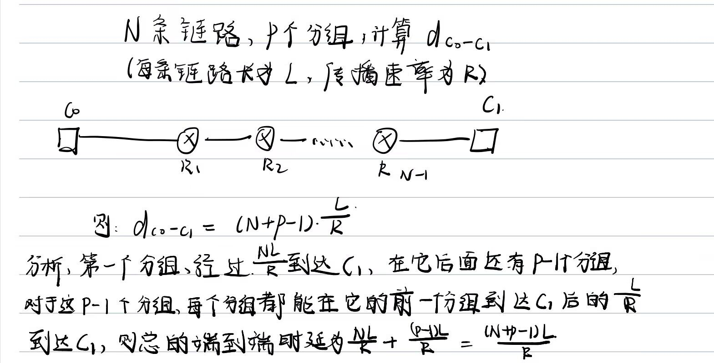
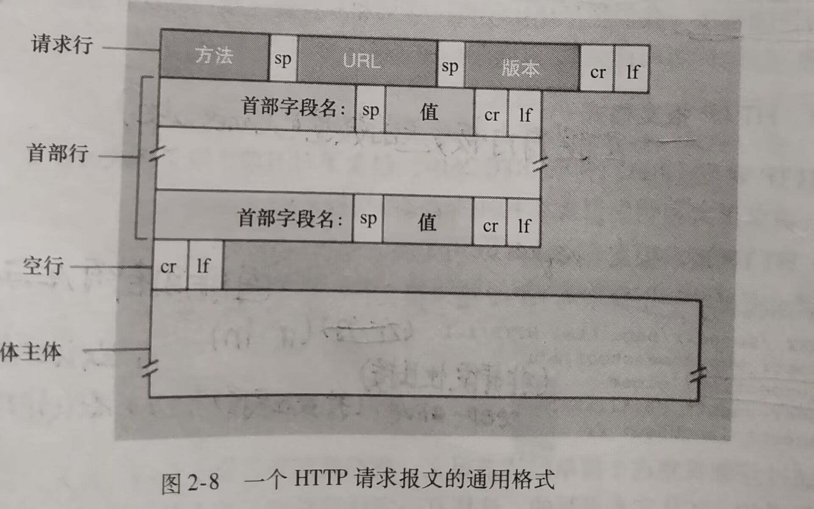
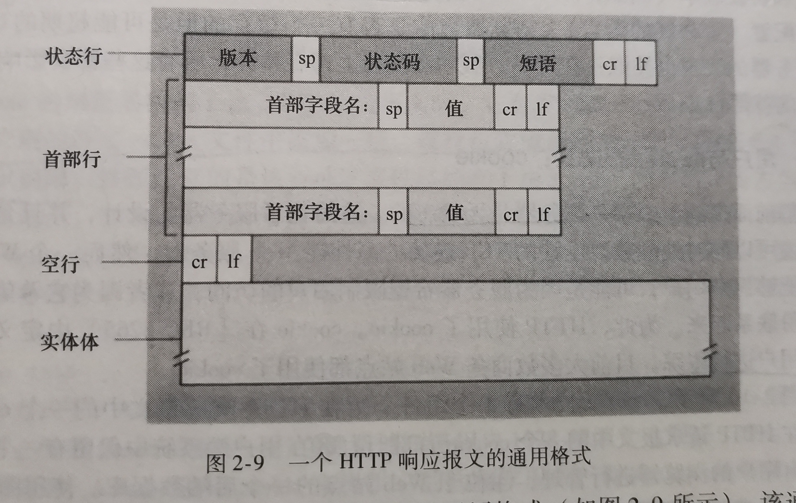
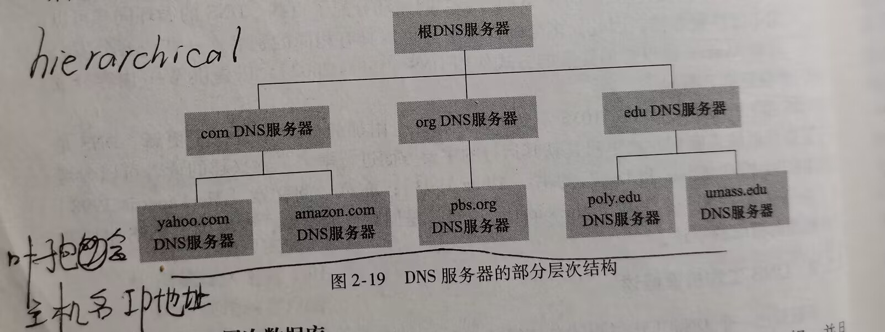
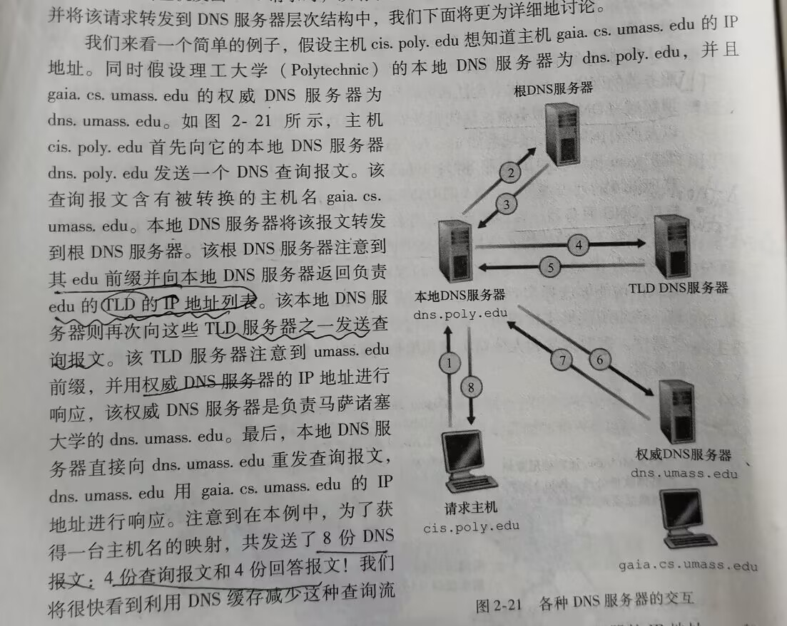
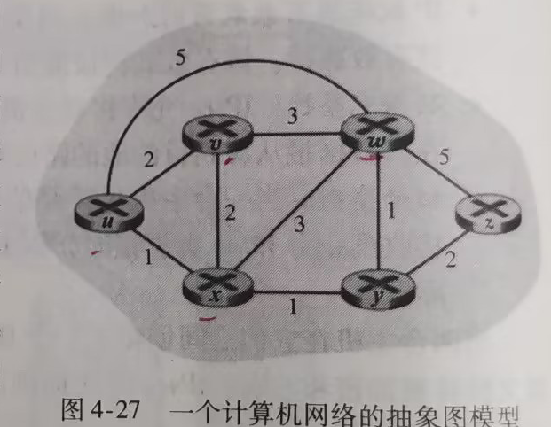
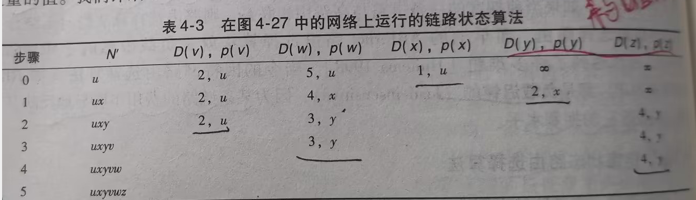
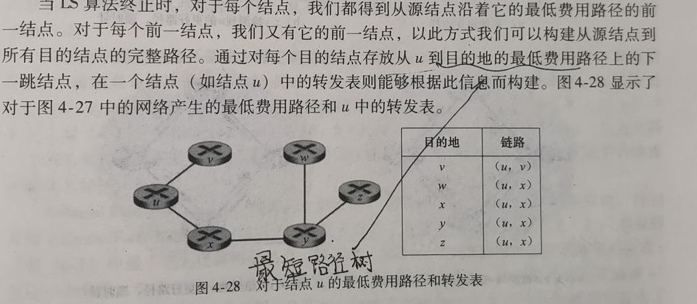
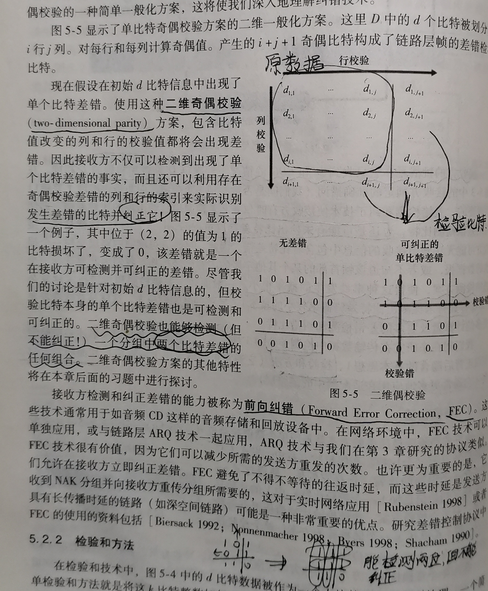

##第一章 计算机网络和因特网

### 1.1 因特网

一些概念：

- **因特网**：一个互联了遍及全世界的数亿计的计算机设备的网络
- **端系统/主机**：连接到因特网中的各种设备。
- 端系统通过**通信链路**和**分组交换机**（packet switch）连接，分组交换机包括**路由器**(router)和**链路层交换机**(link-layer-switch)
- 端系统通过**因特网服务提供商（ISP)**接入因特网
- 因特网的标准由**因特网工程任务组（IETF）**研发，IETF的标准文档称为**请求评论（RFC）**
- **协议：**一个协议定义了在两个或者多个通信实体之间交换的报文格式和次序，以及报文发送/接收一条报文或其他事件所采取的行动。

### 1.2 网络边缘

网络边缘指网络中的各个端系统以及边缘路由器，端系统又称为主机，主机又分为**服务器**和**客户**。

#### 1.2.1 接入网

接入网：指将端系统连接到其边缘路由器的物理链路。

1. 家庭接入：DSL（数字用户线），电缆，FTTH（光纤到户）,拨号和卫星。HFC:(混合光纤同轴)
2. 企业（和家庭）接入：以太网(双绞铜线)和WIFI（无线LAN）
3. 广域无线接入：3G和LTE

#### 1.2.2 物理媒体

双绞铜线、同轴电缆、光纤、陆地无线电信道、卫星无线电线道


### 1.3 网络核心

**网络核心**：即由互联因特网端系统的**分组交换机**和**链路**构成的网状网络。

**传输(transmission)：**将分组向链路输出

**传播（propagation）：**分组在链路中传输

**带宽**：链路的传播速率

**存储转发传输：**指交换机开始向输出链路传输该分组的第一个比特之前，必须接收整个分组。

在这种模式下的时延分析：




#### 1.3.2 电路交换

和**分组交换**(packet switching)不一样，**电路交换**（circuit switching）网络中，在端系统通信会话期间，预留了端系统间通信沿路径所需要的资源(缓存，链路传输速率)，而在分组交换中是不会预留这些资源的。

1. **频分复用（Frequency-Division-Multiplexing）**或**时分复用Frequency-Division-Multiplexing）**。对于FDM，每条链路连续的得到部分带宽。而在TDM中，时间被划分为固定区间的帧，每帧又被划分为固定数量的时隙。每条电路在短时间间隔（即时隙）中周期的得到所有的带宽。
2. 分组交换的优点：

- 它提供了比电路交换更好的带宽共享
- 他比电路交换更简单吗，更有效，实现成本更低。

### 1.4 分组交换中的时延、丢包和吞吐量（考试重点）

#### 1.4.1 分组交换中的时延类型

1. **处理时延:**检查分组首部决定该分组导向何处所需要的时间时处理时延的和一部分。
2. **排队时延**：分组在缓存队列中排队的时延。
3. **传输时延(transmission delay)：**将分组所有比特推向链路所需要的时间。级别通常为毫秒到微秒级别。
4. **传播时延(propagation delay)：**从起点路由器到终点路由器传播所需要的时间。级别通常为毫秒级别。
5. **传输时延和传播时延的区别**：传输时延时路由器将分组推向链路所需要的时间，它是分组长度和链路传输速率的函数；而传播时延时一个**比特**从一台路由器到另一台路由器的传播所需要的时间，它是两台路由器之间的距离的函数，与分组长度和链路传输速率无关。

**结点总时延**：
$$
d_{nodal}=d_{proc}+d_{queue}+d_{trans}+d_{prop}
$$


#### 1.4.2 排队时延和丢包

**流量强度**：a表示分组到达队列的的平均速率（单位为pkt/s）,假定所有分组都是L比特，则比特到达队列的平均速率为La **bps**

假设队列能容纳无穷大的比特数量，则**La/R**被称为**流量强度**。

一个原则：流量强度**不能大于1**

**丢包**：实际上缓存队列并不能无限大，随着流量强度趋向1，排队时延并不实际趋向无穷大，相反，由于没有地方存储这个分组，路由器将丢弃该分组。一个结点的性能并不仅仅根据时延来度量，而且根据分组丢失的概率来度量。


#### 1.4.3 端到端时延

假设源主机和目的主机有N-1台路由器，并且网络无拥塞(不考虑排队时延)，
$$
d_{end-end}=N(d_{proc}+d_{trans}+d_{prop})
$$


#### 1.4.4 计算机网络中的吞吐量

假设传输的文件为F比特，并且另一个主机接收到所有比特用了B s,则**平均吞吐量(average throughtput)**为**F/T bps**.。

设在客户端和服务器有N条链路，每条链路传输速率为$R_1,R_2...,R_N$,则从服务器到客户端的文件传输吞吐量为：
$$
min\{R_1,R_2....,R_N\}
$$
即为文件传输中的**瓶颈链路**

### 1.5 协议层次

**因特网协议栈：**

1. **应用层**：应用层是网络应用程序及它们的应用层协议存留的地方。包括的协议：HTTP，FTP,SMTP。应用层协议分布在多个端系统上，分组称为**报文(message)**。
2. **传输层**：因特网的传输层在应用层序端点之间传送应用层报文。协议有TCP,UDP。分组称为**报文段(segment)**
3. **网络层**：因特网的网络层负责将称为**数据报(datagram)**的网络层分组从一台主机移动到另一台主机，协议有IP协议,以及一些路由选择协议。
4. **链路层：**因特网的网络层通过源和目的地之间的一系列路由器路由数据报。为了将分组从一个结点(主机或者路由器)移动到路径上的下一个结点，网络层将数据报下传给链路层，链路层沿着路径将数据传递给下一个结点。分组称为**帧(frame)**
5. **物理层：**与链路层将帧移动到下一个结点不同，而物理层的任务是将该帧中的**一个一个比特**从一个结点移动到下一个结点。

除了因特网协议栈，还有**OSI(open systems internet**)协议栈。


## 第二章 应用层

### 2.1 应用层协议原理

#### 2.1.1 网络应用程序体系结构

- **客户服务器体系结构：**在这种体系结构下，有一个总是打开的主机称为服务器，它服务与其它主机的请求。客户之间不能直接进行通信。C-S体系结构的一个特点就是服务器具有**固定的、周知的**地址，该地址称为**IP地址。**并且服务器总是打开的。具有该体系的应用程序有：Weeb,FTP，Telnet,和电子邮件。为了避免一台单独的服务器跟不上它所有客户请求，配备大量主机的**数据中心**常被用于创建强大的虚拟服务器。
- **P2P体系结构**：在这个体系结构下，对位于数据中心的专用服务器有最小(或者没有)的依赖，相反，应用程序在间断连接的主机对之间使用直接通信，这些主机被称为对等方。特点是**自扩展性**

#### 2.1.2 进程通信

**客户和服务器进程**

网络应用的通信实际上是应用进程之间的通信，

在给定的一对进程之间的通信会话场景中，发起通信的进程被标识为**客户**，在会话开始时等待联系的进程 是**服务器**。


**套接字**：进程通过一个称为**套接字(socket)**的软件接口向网络发送报文和从网络接收报文，套接字是同一台主机应用层和运输层之间的接口，由于该套接字是建立网络应用程序的可编程接口，因此套接字也被称为应用程序和网络之间的**应用程序编程接口(API)**。


**进程寻址**：需要两种信息：(1) 主机地址（**IP地址**） (2) 目的主机中接收进程的标识符，即**端口号**。


#### 2.1.3 可供应用程序使用的运输服务

1. **可靠数据传输(reliable data transfer)**
2. **吞吐量(throughput)**
3. **定时(timing)**
4. **安全性(security)**

#### 2.1.4 因特网提供的运输服务

**TCP服务**：面向连接，提供可靠数据传输，以及有拥塞控制机制。其中**安全套接字层（SSL）**是TCP加强版，除了提供了TCP的服务，还能进行加密。

**UDP服务**：是一种无连接，并且提供不可靠的数据传送服务，他仅提供最小服务，是一种轻量级的运输层协议。


**流行的应用及其协议**

|     应用     | 应用层协议 | 支撑的运输协议 |
| :----------: | :--------: | :------------: |
|   电子邮件   |    SMTP    |      TCP       |
| 远程终端访问 |   Telnet   |      TCP       |
|     Web      |    HTTP    |      TCP       |
|   文件传输   |    FTP     |      TCP       |
|  流式多媒体  |    HTTP    |      TCP       |
|  因特网电话  |    SIP     |    TCP/UDP     |


### 2.2 WEB和HTTP(重点)

#### 2.2.1 http概述

Web的应用层协议时**超文本传输协议(Hypertext Transfer Protocol)**,由两个程序实现，一个客户程序和一个服务器程序。

一个Web页面包含诸多如html、图片、程序、视频的文件对象，每个文件对象可以通过一个**URL**来寻址。并且HTTP是一个**无状态协议**，即http服务器并不保存关于客户的任何信息，并且Web服务总是打开的。


#### 2.2.2 非持续连接和持续连接

1. - **非持续连接：**客户端首先发起一个TCP连接与服务器建立连接,连接后发起HTTP请求，服务器返回数据对象后，客户端会告诉服务器关闭该TCP连接，后续传输需要重新建立连接。
   - **往返时间（Round-Trip Time,RTT)**：一个短分组从客户端到服务器然后再返回给客户所花费的时间。
   - 粗略的讲，对于非持续性连接，请求一个html对象的时间为2个RTT时间+文件传输时间
   - **缺点**:(1) 需要为每一个请求对象建立和维护一个全新的连接。每个连接在客户和服务器中都要分配**TCP缓冲区**和保持**TCP变量**，给Web服务器带来了严重的负担。(2) 每次需要一个RTT建立连接，时延更大


2. **持续连接**：服务器在响应后，保持TCP连接打开，在相同的客户与服务器之间的后续请求和响应报文能够通过相同的连接进行传送。

**HTTP**默认使用**带流水线的持续连接**。


#### 2.2.3 HTTP报文格式

**1. HTTP请求报文：**

```http
GET /home/index.html HTTP/1.1
Host: www.someschool.edu
Connection:close
User-agent: Mozilla/5.0
Accept-language: en
```

第一行称为**请求行**，后继行叫做**首部行**。请求行有三个字段：**方法字段**，**URL**字段和**HTTP版本**字段。



**方法字段**：

- **GET：**最常用的，用于想服务器请求数据。
- **POST:**通常用向服务器提交表单内容，内容在**实体体(entity body)**里面(GET时实体体为空)。当然，GET也可以提交表单，可以在路径后面加$？r_1\&r_2....$,
- **HEAD**：请求对象的首部，通常用于调试跟踪。
- **PUT:**向服务器上传对象到指定的路径。
- **DELETE**:删除web服务器上的对象。

**Host**：指明主机名。

**Connection:**close表示使用非持续连接，默认是持续连接。

**User-agent**指出发起请求的客户的浏览器类型。

**Accept-langauge**指明用户想得到的该对象的语法版本。


**2. HTTP响应报文**

```http
HTTP/1.1 200 OK
Connection: close
Date: Tue,24 Jan 2023 22:55:00 GMT
Server: Apache/2.2.3
Last-Modifyed: Tue,24 Jan 2023 22:56:00 GMTT
Content-Length: 1000
Content-Type: text/html
```

有三个部分，一个初始**状态行**，一个**首部行**，然后是**实体体**，用来存放数据

**状态行：**由**协议版本**，**状态码**，以及**短语**组成。常见状态码和短语如下：

- **200 OK**:请求成功，数据在返回的响应报文中。
- **301 Moved Permanently**:请求的对象已经被永久转移了，URL在响应报文中。
- **304 Not Modifyed**:在条件GET中，初始服务器向代理服务器标识文件没有被修改，可以直接转发代理服务器中对象的缓存副本
- **400 Bad Reques**t:一个通用差错代码，表示该请求不能被服务器理解。
- **404 Not Found**:被请求的文档不在服务器上
- **505 HTTP Version Not Supported**:服务器不支持请求报文使用的HTTP版本。

**首部行：**

- **Connection**：close告诉客户发送完报文后关闭连接
- **Date**：服务器发送报文的时间
- **Serve**r:服务器类型，类似于请求报文中的User-Agent
- **Last-Modifyed**:对象创建或者修改的最后时间。
- **Content-Length**:被发送对象的字节数。
- **Content-Type**:对象类型


通用格式如下：




#### 2.2.4 用户和服务器的交互：cookie

为了解决HTTP的无状态，引入了cookie,可以用于标识一个用户。在初次访问浏览器时需要提供一个用户标识，在后继会话中，浏览器向服务器传递一个cookie首部，从而向该服务器标识了用户。因此cookie可以在HTTP上建立一个用户会话层。cookie有四个组件

- 在HTTP响应报文中的一个cookie首部行
- 在HTTP请求报文中的一个cookie首部行
- 在用户客户端系统中保留一个cookie文件，由用户浏览器管理。
- 位于web站点的一个后端数据库。


#### 2.2.5 web缓存

**web缓存**又叫**代理服务器**，能够代表**初始Web服务器**来满足HTTP请求的网络实体，并且既是服务器又是客户。

web缓存可以缓存对象副本，当客户发起请求，如果副本在代理服务器，则直接发送给客户，否则像初始服务器发送http请求文件，再发给客户。

部署Web缓存其的原因

- Web缓存器可以大大减少对客户请求的响应时间，特别是当客户与初始服务器之间的瓶颈带宽远低于客户与Web缓存之间的瓶颈带宽更是如此。
- Web缓存器能够大大减少一个机构的接入链路到因特网的的通信量。通过减少通信量减少了费用
- Web缓存器能从整体上大大减低因特网上的流量，从而改善所有应用的性能。

**内容分发网络(content distribution network CDN)**。

#### 2.2.6 条件GET方法

为了解决缓存器副本陈旧的问题，引入了条件GET

如果请求报文中有一条"**If-Modified-Since"**首部行，则为**条件GET请求报文。**Web服务器会检查该首部行后面的时间与最近修改时间对比，如果没有修改，Web服务器向缓存器发送的响应报文包含**304 Not Modified**(并不会包含对象，会浪费带宽),说明文件没有修改。缓存器直接发给客户，否则需要向缓存器发送最新对象副本。

### 2.3 文件传输协议(FTP)


### 2.4 因特网中的电子邮件

### 2.5 DNS:因特网的目录服务(较为重要)

主机的两种标识:**主机名和IP地址**

#### 2.5.1 DNS提供的服务

域名系统Domain Name System):实现主机名到ip地址转换的目录服务。

- 是一个由分层的**DNS服务器**实现的分布式数据库
- 一个使得主机能够查询分布式数据库的应用层协议
- DNS运行在UDP之上，使用53号端口
- 是被其他应用层协议使用的协议

除了进行主机名到IP地址的转换，DNS还提供以下重要服务：

- **主机别名**:有时一个主机的名字很复杂，存在其他**别名**，复杂的名字称为**规范主机名**。
- **邮件服务器别名**
- **负载分配：**DNS也用于在冗余的服务器之间进行负载分配。繁忙的站点被冗余分部在多台服务器上，每台服务器均运行在不同的端系统上，每个都有这不同的IP地址。

#### 2.5.2 DNS工作原理概述

主机-调用DNS客户端-向DNS服务器请求-DNS服务器返回捷信后的ip地址

DNS一种简单设计时因特网上只使用一台DNS服务器，缺点如下

- 单点故障
- 通信容量很大
- 远距离的集中的数据库
- 难以维护

1. 分布式、层次数据库

   

   - **根DNS服务器：**因特网有13个根DNS服务器
   - **顶级域(Top-Level Domain)服务器：**负责顶级域域名如com、org、net、edu、gov、net，以及所有国家的顶级域名如uk、fr、ca、cn、jp等等。
   - **权威DNS服务器：**在因特网上具有公共可访问主机的每个组织机构必须提供公共可访问的DNS记录，这些记录将这些主机的名字映射为IP地址。

   上述出于DNS服务器的层次结构中。在这之外，还有一种重要的服务器：**本地DNS服务器**。每个ISP都有一台本地DNS服务器(起代理的作用)。

   流程如下：

   

2. **DNS缓存：**为了改善时延并减少在因特网上到处传输的DNS报文数量，引入了DNS缓存技术。DNS服务器能够将回答中的信息缓存在本地存储器中。由于主机名到IP地址的映射并不是永久的，DNS服务器在一段时间后将丢弃缓存的信息。（缓存是为了性能，删除是为了一致性）


#### 2.5.3 DNS记录和报文

DNS存储了**资源记录(resource record**)，每一个RR是一个包含了下列字段的四元组
$$
(Name,Value,Type,TTL)
$$

- TTL：记录生存的时间
- 若Type=A,则Name是主机名，Value是对应的IP地址。
- 若Type=NS，则Name是个域(如foo.com),而Value是个知道如何获得该域中主机IP地址的权威DNS服务器的主机名。
- 如果Type=CNAME，则Value是**别名**为Name对应主机的规范主机名。(主机别名到规范名的映射)
- 如果Type=MX，则Value是别名为Name的**邮件服务器的规范主机名**。

当你注册一个公司的域名后，你需要向注册登记机构提交申请，必须提供你的基本和辅助quanweiDNS服务器的名字和IP地址，该机构会想TLD服务器(如com)中插入一条NS记录和一条A记录，对应于该域中主机的权威DNS服务器主机名字和其IP地址。

### 2.6 P2P（了解一下即可）


## 第三章 传输层(重难点)

### 3.1 概述和运输服务

**运输层作用**：为运行在不同主机上的应用进程之间提供了**逻辑通信**，网络层提供了主机到主机的逻辑通信。运输层在端系统中实现，而网络层是在路由器中实现。

**运输层协议和提供的服务**：协议有UDP和TCP协议，二者最基本的责任是：将两个端系统间的IP的交付服务(一种不可靠服务)扩展为运行在端系统上的两个进程之间的交付服务。将主机间交付扩展到进程交付被称为运输层的**多路复用(multiplexing)**与**多路分解(demultiplexing)**。此外，TCP还提供**可靠数据传输**和**拥塞控制**服务。


### 3.2 多路复用和多路分解

**多路分解**：将运输层报文段中的数据交付到正确的套接字的工作称为多路分解。

**多路复用**：在源主机从不同套接字中收集数据块，并未每个数据块封装上首部信息从而生成报文段(segment)，然后将报文段传递到网络层，所有这些工作称为多路复用。

通过**源端口号**和**目的端口号**来确定该报文段要交付的目的套接字。端口号为16比特数，0-1023为**周知端口号(well-known port number)**是首限制的，保留了诸如HTTP(80).FTP(21)等。

**TCP和UDP的套接字:**

- 一个**UDP套接字**由一个**二元组**来全面标识，即**目的IP地址和目的的端口号。**(无连接)
- 一个**TCP套接字**由一个**四元组**标识，包括**源IP地址，源端口号，目的IP地址,目的端口号**(面向连接)
- 注意这里，一个socket通常对应一个进程，但一个进程通常会有多个线程，这些线程之间对应的套接字是不一样的。


### 3.3 无连接运输：UDP

#### 3.3.1 UDP报文段结构

#### 3.3.2 UDP检验和


### 3.4 可靠数据传输原理(难点)

#### 3.4.1 构造可靠数据传输协议

#### 3.4.2 流水线可靠数据传输协议

#### 3.4.3 回退N步(GBN)

#### 3.4.4 选择重传(SR)


#### 

### 3.5 面向连接的运输：TCP

### 3.6 拥塞控制原理

### 3.7 TCP拥塞控制


## 第四章 网络层

### 4.5 路由选择算法

**默认路由器**，又叫主机的**第一条路由器**，是与主机连接的第一台路由器。我们将源主机的默认路由器称作**源路由器**，把目的主机的默认路由器称作**目的路由器**。

- **全局式路由选择算法**：用完整的，全局性的网络知识计算出从源到目的地之间的最短路径，即需要知道所有节点之间的连通性以及所有链路的费用。具有全局状态信息的算法称为**链路状态(LS)**算法。
- **分散式路由选择算法**：以迭代，异步和分布式的方式计算出最低费用路径。每个节点仅拥有与其直接 相邻链路的费用。典型算法：DV(距离向量算法)

另一种分类：

- **静态式路由选择算法**：随着时间流逝，路由变化非常缓慢，通常需要人工进行干预。
- **动态式路由选择算法**：当网络流量负载或拓扑发生变化时改变路由选择路径。

第三种分类：

- **负载敏感算法**:链路费用会动态的反应出底层链路的拥塞水平
- **负载迟钝算法**

#### 4.5.1 链路状态(LS)路由选择算法

**Dijkstra算法：**

几个概念：

- **D(v)**：本次迭代，从源节点到节点v的最短路径
- **p(v)**:从源到v的沿着当前最低费用路径的前一节点(前驱，v的邻居)。
- $N^{'}$:当前已经求出最短路径的节点集合

一个例子：







算法结束后，可以得u中的转发表：




#### 4.5.2 距离向量(DV)路由选择算法

$bellman-ford$方程：

$设d_x(y)是结点x到结点y的最短路径，v是x的邻居$
$$
d_x(y)=min_v\{c(x,v)+d_v(y)\}
$$
$bellman-ford$方程的解为结点**x的转发表提供了表项**

基本思想：

每个结点$x$以$D_x(y)$开始，对在$N$中所有的结点，**估计**自己到结点$y$的最短路径。令$D_x=[D_x(y):y\in N]$为结点$x$的距离向量表示$x$到$N$中其他所有结点的当前最短距离。使用$DV$算法结点，每个$x$维护下列路由选择信息

- 对于每个邻居$v$,从$x$到$v$的费用为$c(u,v)$
- 结点$x$的距离向量，即$D_x=[D_x(y)：y\in N]$,包含了$x$到所有点$y$费用的估计值
- 它的每个邻居$v$的距离向量

每个结点不时地向邻居发送自己的距离向量副本，当结点x的邻居向他发送距离向量时，它保存$v$的距离向量，然后使用$bellman-ford$方程更新自己的距离向量：
$$
D_x(y)=min_v\{c(x,v)+D_v(y)\}
$$
如果结点$x$的距离向量发生改变，将向邻居发送自己的新的距离向量。所有结点以这种异步方式交换距离向量，每个节点的$D_x(y)$将会收敛到$d_x(y)$                                                                                                                                                                     

当收敛后，每个结点向y转发的下一跳路由器即$v^*(y)$，即在$bellman_ford$方程中取得最值的邻居$v$,如果有多个则会选择任意一个。

**链路费用改变导致的无穷计数问题以及毒性逆转：**


**LS算法和DV算法比较**

- **报文复杂性**：LS必须直到每条链路的费用，因此需要发送$O(|V||E|)$个报文，且无论何时一条链路发生改变时，必须向所有结点发送新的链路费用。DV要求每次迭代发送相邻结点的链路费用。DV算法当且仅当在新的链路费用更优时才传播已经改变的链路费用。
- **收敛速度**：LS收敛速度为$O(|V|^2)$,而DV算法收敛较慢，且收敛是会遇到路由选择环路。DV算法还会导致无穷计数问题
- **健壮性**：LS算法具有较强的健壮性，而DV算法中，一个结点可以向任意或所有目的结点通告其不正确的最低费用路径。


#### 4.5.3 层次路由选择

**自治系统（AS)**：每个AS由一组通常处相同管理控制下的路由器组成(例如，由相同的ISP运营或属于相同的公司网络)，每个AS又包括不同的子网。

在相同的AS中的所有路由器都全部运行同样的路由选择算法，且拥有彼此的信息。在一个AS内运行的路由选择算法叫做**自治系统内部路由选择协议**。当然，将AS彼此互相关联是必需的，因此在一个AS内的一台或多台路由器将有另外的任务，即负责向在本AS之外的目的地转发分组。这些路由器被称为**网关路由器(gateway router)**。

如果在一个AS中仅有一台网关路由器连接其他AS，则该AS中的一台路由器若想向外部AS发送分组，只需要根据自治系统内部路由选择协议将分组送给内部的网关路由器，再由网关路由器向其所直连的路由器转发。

若AS有多个网关路由器通向外部，处理这种情况，该AS需要：

- 知道经过该AS各个网关路由器所连接的AS可以到达哪些目的地
- 向该AS中的所有路由器传播这些可达性信息，因此每台路由器能够配置它的转发表以处理外部AS目的地。

从相邻AS获取可达性信息和向该AS内部传达可达性信息由**自治系统间路由选择协议**处理。因特网中所有的AS都运行相同的AS间路由选择协议，称为**BGP4。**

在实践中经常使用经常使用的一种方案是**热土豆路由选择**，在这种方案下，AS尽可能尽快地(尽可能经济的)扔掉分组(热土豆)，即按照自治系统内部选择协议选择费用最小的网关路由器(前提是可达目的地)，发送分组到这个网关路由器。选择之后，该路由器将会增加该子网的转发表表项

### 4.6 因特网中的路由选择

####  4.6.1 因特网中自治系统内部的路由选择：RIP

AS内部路由选择又被称为**内部网关协议**。比较出名的是**路由选择信息协议(Routing Information Protocol)**和**开放最短路优先协议(Open Shortest Path First)**。


RIP是一种距离向量协议，

####  4.6.2 因特网中自治系统内部的路由选择：OSPF

####  4.6.3 自治系统间的路由选择：BGP


### 4.7 广播和多播路由选择(大概了解)

#### 4.7.1 广播路由选择算法

#### 4.7.2 多播


## 第五章 链路层：链路、接入网和局域网


### 5.1 链路层概述

**结点**：运行链路层协议的任何设备称为结点，结点包括主机、路由器、交换机和WiFi接入点等等。

**链路**：沿着通信路径连接相邻结点的通信信道称为链路。

在通过特定的链路时，传输结点将数据封装在**链路层帧**中。

#### 5.1.1 链路层提供的服务

- **成帧(framing)**
- **链路接入**：**媒体访问控(MAC)**制协议规定了帧在链路上传输的规则。
- **可靠交付**
- **差错检测和纠正**

#### 5.1.2 链路层在何处实现

链路层主体在**网络适配器(network adapter)**实现，网络适配器有时又被称为**网络接口卡(Network Interface Card)**，位于网络适配器核心的是**链路层控制器**，是一个实现了许多链路服务的专用芯片。因此，链路层服务大多是硬件实现的

### 5.2 差错检测和纠正技术

使用**差错检测和纠正比特（EDC)**来增强数据D,接收方需要接收到$D'和EDC'$,确定D和D’是否相同，若不同，则称检测到了一个差错。(不是出现差错)

未检测出差错都可能存在，需要选择合适检测错误方案，使得这种错误出现概率尽可能小。

三种差错检测方法：

- **奇偶校验**
- **检验和方法**
- **循环冗余检测(Cyclic Redundancy Check)**

#### 5.2.1 奇偶校验

增加奇偶校验位，保证1的个数为奇/偶，但当同时有两个以上比特发生差错，无法检测，于是引入了二维奇偶校验



#### 5.2.2 校验和

检验和中，将d比特数据看成一个k比特整数序列。然后将这些序列处理，一个简单方法就是将这些序列加起来。**因特网检验和**就是这样，将数据字节作为16比特序列求和，然后将反码形成了报文中的因特网检验和。接收方只需要通过接收的数据(包括检验和)的和取反码，看看是否为全1 比特。有0就说明出现了差错。TCP和UDP对首部和数据字段都要计算检验和，而IP数据报只需要计算首部校验和。

#### 5.2.3 循环冗余检测(CRC)

**循环冗余检测编码**又被称为**多项式编码**。

**生成多项式**：如1011：表示为$x^3+x+1$

**模2运算：**在这种运算下，加法不进位，减法不借位。

发送和接收方需要约定一个$r+1$比特的**生成多项式**，对于d比特的数据，在后面添加一个r比特的数据$R$,使得
$$
D*2^r\oplus R=nG\Leftrightarrow D*2^r=nG\oplus R
$$
因此我们可以在模2运算下计算$D*2^r除以G$的余数即为R。


算完之后可以代回去检测一下是否成立。


### 5.3 多路访问链路和协议(重点)


### 5.4 交换局域网

#### 5.4.1 链路层寻址和ARP(掌握)


#### 5.4.2 以太网

#### 5.4.3 链路层交换机(掌握)

